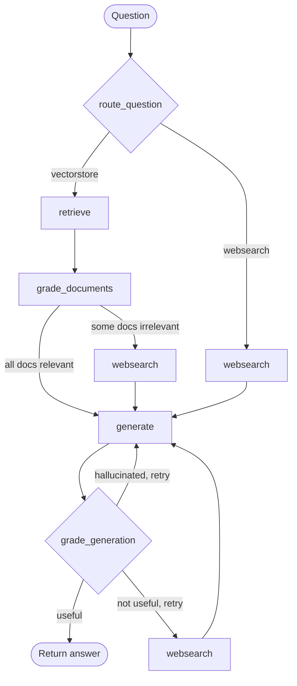

# CRAG Multi-Agent

**A production-grade Corrective RAG (CRAG) platform** — a self-correcting, multi-agent LangGraph
pipeline behind a full-stack SaaS application (FastAPI + Next.js), shipped to production three
different ways on AWS (serverless, containers, and Kubernetes), each with its own fully automated
CI/CD pipeline.

[](https://github.com/SrikanthArgp/SearchAssistantProduction/actions/workflows/ci.yml)


> Repository: [`SrikanthArgp/SearchAssistantProduction`](https://github.com/SrikanthArgp/SearchAssistantProduction)

---

## Table of Contents

- [Overview](#overview)
- [Why This Project](#why-this-project)
- [Architecture](#architecture)
  - [The CRAG Agent Graph](#the-crag-agent-graph)
  - [Application Architecture](#application-architecture)
  - [Deployment Architectures](#deployment-architectures)
- [Tech Stack](#tech-stack)
- [Repository Structure](#repository-structure)
- [Getting Started](#getting-started)
- [Ways to Run This App](#ways-to-run-this-app)
  - [1. Local Development (hot reload)](#1-local-development-hot-reload)
  - [2. Docker Compose (one command, full stack)](#2-docker-compose-one-command-full-stack)
  - [3. AWS Serverless — Lambda + API Gateway + CloudFront](#3-aws-serverless--lambda--api-gateway--cloudfront)
  - [4. AWS Containers — ECS Fargate](#4-aws-containers--ecs-fargate)
  - [5. Kubernetes — EKS + Helm + ArgoCD GitOps](#5-kubernetes--eks--helm--argocd-gitops)
- [CI/CD Pipelines](#cicd-pipelines)
- [Testing Strategy](#testing-strategy)
- [Observability & Evaluation](#observability--evaluation)
- [Deployment Comparison](#deployment-comparison)
- [Documentation Index](#documentation-index)
- [Project Status](#project-status)
- [License](#license)

---

## Overview

This project implements **Corrective RAG (CRAG)** — a retrieval-augmented generation pattern that
doesn't just retrieve-and-generate, but actively grades its own retrieval quality, falls back to
live web search when local context is insufficient, and re-checks its own output for hallucination
and relevance before returning an answer. The agent is built as a stateful graph with
[LangGraph](https://github.com/langchain-ai/langgraph), wrapped in a JWT-authenticated,
multi-tenant REST API (FastAPI) with persistent chat sessions (PostgreSQL + LangGraph
checkpointing), a Redis-backed session/cache layer, and a Next.js chat frontend with token
streaming.

What sets this repository apart from a typical LangGraph demo is everything built *around* the
agent: a RAGAS/Langfuse evaluation suite, OpenTelemetry distributed tracing, a hardened
unit/integration test suite, full Dockerization, and — the bulk of the engineering effort — **three
independent, Terraform-provisioned production deployments on AWS** (serverless, ECS containers,
and Kubernetes), each wired to its own GitHub Actions CI/CD pipeline, including a full GitOps
delivery flow via ArgoCD for the Kubernetes target.

## Why This Project

This started as a LangGraph CRAG tutorial implementation and was deliberately taken all the way to
"how would this actually ship and stay operable in a real company" — not by imagining the answer,
but by building each layer, breaking it, and fixing the real gap:

- **Agent design**: self-correction loops (document grading, hallucination grading, answer
  grading) instead of a naive retrieve-then-generate chain.
- **Productionization**: auth, persistence, caching, rate limiting, structured logging, dependency
  health checks — the parts a demo skips.
- **Evaluation & observability**: RAGAS metrics scored against a fixed dataset, Langfuse tracing
  for every LLM call, OpenTelemetry spans for the rest of the stack, correlated via a shared
  request ID.
- **Deployment breadth, on purpose**: the same application deployed as Lambda functions, as an ECS
  Fargate service, and as Kubernetes pods on EKS — a deliberate exercise in comparing serverless,
  container, and orchestration tradeoffs on cost, operational complexity, and control, not a
  "pick one and move on" decision.
- **Delivery automation**: every deployment target has its own CI/CD path, including both the
  conventional "CI job calls the cloud API directly" model (Lambda, ECS) and true GitOps (EKS via
  ArgoCD), so the tradeoffs between the two are visible in working code, not just in a slide.

## Architecture

### The CRAG Agent Graph



Built with LangGraph as a compiled `StateGraph` (`backend/multi_agent/graph.py`) over a typed
`GraphState` (`question`, `documents`, `generation`, `web_search`). Each node is a thin wrapper
around a standalone LangChain runnable (`backend/multi_agent/chains/`) — a router, a per-document
relevance grader, the generation chain itself, a hallucination grader, and an answer grader — all
using structured (Pydantic) output where a grading decision is required. See
[`CLAUDE.md`](./CLAUDE.md) for the full node/chain breakdown.

### Application Architecture

```
Browser (Next.js chat UI)
   │  JWT bearer + SSE streaming
   ▼
FastAPI REST API  ── /v1/auth  /v1/sessions  /v1/chat  /health
   │                     │
   │           ┌─────────┴─────────┐
   ▼           ▼                   ▼
LangGraph   PostgreSQL          Redis
CRAG graph  (users, sessions,   (session cache,
(per-request  messages,          rate limiting,
 checkpointer) LangGraph          token revocation)
   │           checkpoints)
   ▼
OpenAI · Tavily · Chroma (local vector store)
```

The graph is compiled per-request via `create_app(checkpointer)`
(`backend/multi_agent/graph.py`) — the CLI entry point uses an in-memory `MemorySaver`, while the
API compiles it with `AsyncPostgresSaver` bound to a shared connection pool, so conversation state
survives restarts and `chat_sessions.id` doubles as the LangGraph `thread_id`.

### Deployment Architectures

The exact same application ships to AWS three independent ways, each provisioned with its own
Terraform root (`infra/lambda-gate/`, `infra/fargate/`, `infra/eks/`) and validated on LocalStack
before every real-AWS apply:

| | Serverless (Lambda) | Containers (ECS Fargate) | Kubernetes (EKS) |
|---|---|---|---|
| **Compute** | 2 Lambda functions behind API Gateway + a streaming Function URL | 1 Fargate task behind an ALB | Pods on a managed node group behind an ALB (via the AWS Load Balancer Controller) |
| **Streaming (SSE)** | AWS Lambda Web Adapter + `RESPONSE_STREAM` Function URL | Native — a long-lived container streams directly | Native — same as Fargate |
| **Scaling** | Automatic, pay-per-invocation | Application Auto Scaling (target-tracking CPU) | HorizontalPodAutoscaler (wired; needs `metrics-server` to be functional) |
| **Secrets** | SSM Parameter Store, read at cold start | SSM, read at runtime via `boto3` | SSM, read at runtime via `boto3` — direct IRSA, not the Secrets Store CSI Driver |
| **Delivery** | GitHub Actions → OIDC → direct `update-function-code` / `terraform apply` | GitHub Actions → OIDC → direct `update-service` / `terraform apply` | GitHub Actions builds & pushes only — **ArgoCD** watches this repo's `gitops/` path and reconciles the cluster (true GitOps) |
| **At-rest cost** | ~$0 (pay-per-use, free tier) | ALB hourly charge (~$16–20/mo) | EKS control-plane flat fee (~$73/mo) + nodes + ALB |

Full as-built architecture diagrams (zoomable/pannable, one per phase) are in
[`architecture-diagrams.html`](./architecture-diagrams.html) — open it directly in a browser.

## Tech Stack

| Layer | Technology |
|---|---|
| **Agent orchestration** | LangGraph, LangChain, OpenAI (generation/grading), Tavily (web search), Chroma (vector store) |
| **Backend API** | FastAPI, Pydantic, SQLAlchemy 2.0 (async), Alembic, `python-jose` (JWT), `bcrypt` |
| **Frontend** | Next.js 16 (App Router), React 19, TypeScript, Tailwind CSS 4 |
| **Persistence** | PostgreSQL (via Supabase), Redis (Upstash in the cloud / local Docker in dev) |
| **Evaluation** | RAGAS, Langfuse (LLM/agent tracing + eval scoring) |
| **Observability** | OpenTelemetry (FastAPI/SQLAlchemy/Redis spans) → Grafana Cloud (Tempo), structured logging (`structlog`) |
| **Testing** | pytest (backend, unit + integration tiers), Vitest + Testing Library (frontend unit), Playwright (e2e) |
| **Containerization** | Docker, Docker Compose |
| **Infrastructure as Code** | Terraform (3 independent roots + a shared bootstrap stack) |
| **Cloud** | AWS — Lambda, API Gateway, ECS Fargate, EKS, CloudFront, S3, ECR, SSM Parameter Store, IAM/IRSA, ALB |
| **CI/CD** | GitHub Actions (OIDC role assumption, no long-lived cloud keys), ArgoCD (GitOps for the Kubernetes target) |
| **Package management** | `uv` (backend), `npm` (frontend) |

## Repository Structure

```
crag-multi-agent/
├── backend/                    # Python backend — its own project root (backend/pyproject.toml, .venv)
│   ├── multi_agent/            # The CRAG agent itself — graph, chains, nodes, ingestion
│   ├── api/                    # FastAPI app: routers, schemas, dependencies, error handling
│   ├── auth/  cache/  db/      # JWT auth, Redis cache layer, Postgres/SQLAlchemy layer
│   ├── eval/                   # RAGAS/Langfuse evaluation suite
│   ├── tests/                  # Unit + integration test suite (marker-based tiers)
│   └── run_api.py              # Entry point (do NOT run uvicorn directly — see its docstring)
├── frontend/                   # Next.js chat UI (auth flow + streaming chat)
├── infra/
│   ├── bootstrap/               # Shared Terraform state backend + GitHub OIDC roles
│   ├── lambda-gate/             # Serverless deployment (Lambda + API Gateway + CloudFront)
│   ├── fargate/                 # Container deployment (ECS Fargate + ALB + CloudFront)
│   └── eks/                     # Kubernetes deployment (EKS + IRSA + CloudFront)
├── gitops/multi-agent/          # Helm chart deployed to EKS, watched by ArgoCD
├── argocd/                      # ArgoCD Application manifest
├── .github/workflows/           # ci.yml (lint+test) + cd.yml dispatcher → cd-lambda/cd-ecs/cd-eks.yml
├── docker-compose.yml            # Full local stack: backend + frontend + Redis
├── architecture-diagrams.html    # Zoomable as-built architecture diagrams, all deploy targets
├── plan.md / completed.md        # Full design history and build log, phase by phase
└── *-deploy-steps.md             # Per-phase, copy-pasteable deployment runbooks
```

## Getting Started

**Prerequisites:**
- Python 3.11+ and [`uv`](https://docs.astral.sh/uv/)
- Node 20.9+ and `npm`
- Docker Desktop (optional for local dev, required for the Docker Compose path)
- API keys: `OPENAI_API_KEY`, `TAVILY_API_KEY` (both required); `LANGFUSE_*` optional for tracing

```bash
git clone https://github.com/SrikanthArgp/SearchAssistantProduction.git
cd SearchAssistantProduction/backend
cp .env.example .env        # fill in OPENAI_API_KEY, TAVILY_API_KEY, DATABASE_URL, REDIS_URL, JWT_SECRET_KEY
uv sync --extra dev --extra prod --extra eval
```

The Chroma vector store (`backend/multi_agent/.chroma/`) is **committed to git** — the corpus is
static, so a fresh checkout already has a working vector store; nothing needs to be ingested
before running the graph.

## Ways to Run This App

This project is deliberately runnable five different ways, from a bare local process up to a
full Kubernetes/GitOps production deployment — pick the one that matches what you're trying to
evaluate.

### 1. Local Development (hot reload)

The fastest inner loop — backend and frontend run directly on the host with hot reload.

```bash
# Terminal 1 — optional Redis (everything degrades gracefully without it)
docker start crag-redis   # or: docker run -d --name crag-redis -p 6379:6379 redis:7

# Terminal 2 — backend
cd backend
uv run python run_api.py          # NOT `uvicorn api.main:app` directly — see run_api.py's docstring
curl http://localhost:8000/health # {"status":"ok","db":true,"redis":true}

# Terminal 3 — frontend
cd frontend
cp .env.local.example .env.local   # NEXT_PUBLIC_API_BASE_URL=http://localhost:8000/v1
npm install
npm run dev                        # http://localhost:3000
```

Or run the agent alone, headless, with no API/DB/auth involved:

```bash
cd backend
uv run python multi_agent/main.py
```

### 2. Docker Compose (one command, full stack)

Backend + frontend + Redis, containerized (PostgreSQL stays on Supabase either way):

```bash
# backend/.env and frontend/.env.local populated first (same files as above)
docker compose up --build
```

Once `docker compose ps` shows all services `healthy`, open `http://localhost:3000`.

### 3. AWS Serverless — Lambda + API Gateway + CloudFront

Backend runs as two Lambda functions (a buffered one behind API Gateway, a `RESPONSE_STREAM` one
behind its own Function URL for SSE) via the AWS Lambda Web Adapter; frontend is a static Next.js
export on S3 behind CloudFront. Fully pay-per-use — the cheapest at-rest option of the three.

```bash
cd infra/lambda-gate
terraform init -backend-config=backend-aws.hcl
terraform apply
```

Full runbook: [`enterprize-deploy-steps.md`](./enterprize-deploy-steps.md).

### 4. AWS Containers — ECS Fargate

Backend runs as a long-lived Fargate task behind an Application Load Balancer — no adapter layer
needed, SSE streams natively. Same frontend/CloudFront shape as the serverless target, fully
independent Terraform state and ECR repo.

```bash
cd infra/fargate
terraform init -backend-config=backend-aws.hcl
terraform apply
```

Full runbook: [`grand-enterprize-deploy-steps.md`](./grand-enterprize-deploy-steps.md).

### 5. Kubernetes — EKS + Helm + ArgoCD GitOps

Backend runs as pods on a managed EKS node group, exposed via the AWS Load Balancer Controller
reconciling a Kubernetes `Ingress` into a real ALB. Deployed via a Helm chart
(`gitops/multi-agent/`) that ArgoCD manages — the ongoing delivery model is genuine GitOps: CI
never touches the cluster directly, it only builds an image and commits an image-tag bump.

```bash
# Stage 1 — one-time cluster bring-up (Terraform)
cd infra/eks
terraform init -backend-config=backend-aws.hcl
terraform apply

# Stage 2 — one-time app + ArgoCD bootstrap (Helm)
helm install multi-agent gitops/multi-agent -n default \
  --set image.repository=<ecr-repo-url> \
  --set serviceAccount.roleArn=<backend-irsa-role-arn>
kubectl apply -f argocd/multi-agent-application.yaml

# After this, every subsequent deploy is: push to main → cd-eks.yml builds/pushes an
# image → bumps gitops/multi-agent/values.yaml → ArgoCD auto-syncs the cluster
```

Full runbooks: [`eks-manual-deploy-steps.md`](./eks-manual-deploy-steps.md) (cluster bring-up),
[`ci-cd-eks-steps.md`](./ci-cd-eks-steps.md) (the ArgoCD GitOps CD flow).

All three cloud targets are validated against **LocalStack** before every real-AWS apply, and all
Terraform state lives in a shared S3 + DynamoDB backend provisioned once via `infra/bootstrap/`.

## CI/CD Pipelines

```
push / PR to main
      │
      ▼
  ci.yml  ──►  changes (paths-filter)  ──►  backend (ruff + pytest)
                                       └──►  frontend (eslint + vitest + next build)
      │
      ▼  (manual workflow_dispatch)
 cd.yml dispatcher  ──►  target: lambda  ──►  cd-lambda.yml  ──►  direct AWS API deploy
                    ├──►  target: fargate ──►  cd-ecs.yml    ──►  direct AWS API deploy
                    └──►  target: eks     ──►  cd-eks.yml    ──►  bumps gitops/values.yaml
                                                                    │
                                                                    ▼
                                                          ArgoCD syncs the cluster
```

- **CI** (`ci.yml`) runs on every push/PR to `main`: lint + the fast (dependency-free) test tier
  for both backend and frontend, gated behind a `changes` job so doc-only diffs don't block on
  services that were never touched.
- **CD** is a manual `workflow_dispatch` dispatcher (`cd.yml`) by design during active
  development — it resolves a `target` (`lambda` / `fargate` / `eks` / `all`) and an
  `environment` (`aws` / `localstack`), then invokes the matching reusable workflow. Every deploy
  role is scoped independently via GitHub OIDC — no long-lived AWS credentials anywhere in CI.
- Lambda and Fargate both take a **fast path** (direct `update-function-code` /
  `update-service` call) when only application code changed, or a **full `terraform apply`** when
  the diff touches their own `infra/**` subtree — with an automated smoke check and, for Lambda, an
  explicit rollback to the previous image on a failed check.
- EKS is the one target where CI **never touches the cluster**: `cd-eks.yml`'s job ends at a bot
  commit bumping the image tag; ArgoCD's own in-cluster reconciliation loop (`prune` + `selfHeal`)
  does the actual rollout.

## Testing Strategy

```bash
# Backend — fast unit tier (no external services needed)
cd backend && uv run python -m pytest -m "not integration and not requires_db and not requires_redis"

# Frontend — unit tests
cd frontend && npm test

# Frontend — end-to-end (auto-starts backend + dev server)
cd frontend && npm run test:e2e
```

The backend suite is split into unit and integration tiers via pytest markers
(`integration`, `requires_db`, `requires_redis`) so CI can run a fast, dependency-free tier while
a full local/integration run still exercises real Postgres/Redis/LLM calls. The frontend has
component tests (Vitest + Testing Library) and full end-to-end browser tests (Playwright,
auto-provisioning both the backend and dev server). Every phase of the productionization effort
included an explicit **failure-path** test, not just the happy path — e.g. Redis-down fail-open
behavior, a killed ECS task being replaced without dropping traffic, ArgoCD keeping the previous
pods alive on a bad deploy.

## Observability & Evaluation

- **Langfuse** — every LLM/agent call is traced end-to-end (`backend/multi_agent/observability/`),
  tagged with `user_id`/`session_id`/`trace_name`, and used to score the RAGAS evaluation suite
  (`backend/eval/`) against a fixed dataset — plus an online-evaluation pass that scores live chat
  traces using the graph's own self-correction graders.
- **OpenTelemetry → Grafana Cloud** — general application tracing (FastAPI, SQLAlchemy, Redis
  spans), kept deliberately separate from Langfuse's LLM-level detail and correlated with it via a
  shared `X-Request-ID`, so a single request can be traced across both tools.
- **Structured logging** (`structlog`) — every log line carries `request_id`/`user_id`/
  `session_id` plus the active OTel `trace_id`/`span_id`.
- **`/health`** runs real dependency checks (`SELECT 1` against Postgres, Redis `PING`), not just
  a static 200.

## Deployment Comparison

| | Serverless (Lambda) | Containers (ECS Fargate) | Kubernetes (EKS) |
|---|---|---|---|
| Best for | Spiky/low traffic, minimal ops | Steady traffic, simpler mental model than K8s | Learning/using real Kubernetes, multi-workload clusters |
| Ops overhead | Lowest | Low | Highest (cluster lifecycle, node management) |
| Cold starts | Yes (mitigated by Lambda Web Adapter keeping a real process warm) | No | No |
| Teardown discipline | Optional — true $0 at rest | Recommended (ALB hourly charge) | **Required** — control-plane fee accrues regardless of usage |

Full cost/rationale breakdown: [`plan.md`](./plan.md#cost-profile-summary-phases-15-16-20).

## Documentation Index

| Doc | Covers |
|---|---|
| [`CLAUDE.md`](./CLAUDE.md) | Codebase structure, conventions, architecture deep-dive |
| [`plan.md`](./plan.md) | Full target design, every phase, every key design decision + rationale |
| [`completed.md`](./completed.md) | What's actually built and verified, phase by phase, including every real gap found |
| [`architecture-diagrams.html`](./architecture-diagrams.html) | Zoomable/pannable as-built architecture diagrams for every deployment target |
| [`enterprize-deploy-steps.md`](./enterprize-deploy-steps.md) | Lambda serverless deployment runbook |
| [`grand-enterprize-deploy-steps.md`](./grand-enterprize-deploy-steps.md) | ECS Fargate deployment runbook |
| [`eks-manual-deploy-steps.md`](./eks-manual-deploy-steps.md) | EKS cluster bring-up runbook (copy-pasteable commands) |
| [`ci-cd-eks-steps.md`](./ci-cd-eks-steps.md) | ArgoCD GitOps CD flow for the EKS target |
| [`ci-pipeline-steps.md`](./ci-pipeline-steps.md) | CI pipeline design |
| [`cd-lambda-deploy-steps.md`](./cd-lambda-deploy-steps.md) / [`cd-ecs-deploy-steps.md`](./cd-ecs-deploy-steps.md) | Lambda / ECS CD pipeline design |
| [`cd-dispatcher-steps.md`](./cd-dispatcher-steps.md) | The `cd.yml` manual dispatcher design |
| [`real-aws-cicd-setup.md`](./real-aws-cicd-setup.md) | Real-AWS CI/CD verification account (gaps found, fixes applied) |

## Project Status

All 21 planned phases are **built and verified**: agent graph → REST API → auth/persistence/cache
→ frontend → evaluation suite → Dockerization → test hardening → production hardening →
observability → three independent AWS deployment targets → CI → CD for all three targets,
including full GitOps for Kubernetes. See [`completed.md`](./completed.md) for the phase-by-phase
build log and every real-world gap found and fixed along the way — nothing in this repo is a
from-scratch design doc that was never actually run.

Explicitly deferred (not in scope, tracked in `plan.md`): password-reset email flow, additional
XSS hardening on markdown rendering, security response headers (CSP/HSTS), secrets rotation beyond
SSM, and multi-region high availability.

## License

No license file is currently published in this repository — all rights reserved by the author
unless a license is added.
