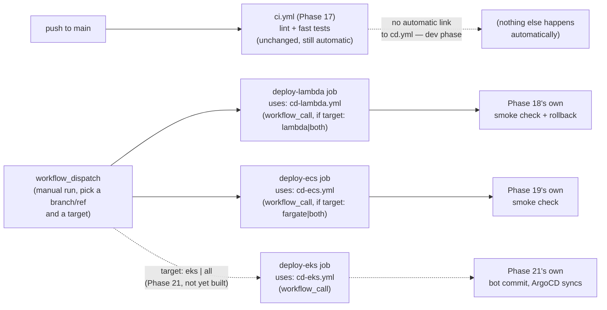

# CD Dispatcher (`cd.yml`): Step-by-Step

Scope: a single entry point, `.github/workflows/cd.yml`, that fans out to [Phase 18's Lambda deploy](./cd-lambda-deploy-steps.md), [Phase 19's ECS Fargate deploy](./cd-ecs-deploy-steps.md), and — once built — [Phase 21's EKS GitOps commit](./ci-cd-eks-steps.md), instead of each of those workflows triggering independently off `push`. Full rationale for the dispatcher pattern itself lives in `plan.md`'s design note before its Phase 18 section (added 2026-07-11) — this doc is the execution checklist plus the operational detail that note intentionally left out.

**Dev-phase decision (2026-07-11, updated same day): manual-only, no automatic trigger.** `cd.yml` is `workflow_dispatch`-only for now — nothing deploys until someone explicitly runs it and picks a `target`. The original design also included a `workflow_run` trigger (auto-deploy after `ci.yml` goes green), matching Phase 18/19's original always-deploy-on-merge behavior; that's deliberately **deferred**, not abandoned — see "Deferred: Adding the Automatic Trigger Later" below, which preserves the design work already done for it (target/sha resolution across two event types, the CI-vs-`main`-tip race) so it isn't lost, just not needed yet. Reasoning: during active development, deploying on every merge to `main` removes exactly the control you want while iterating — a manual, explicit `target` choice per run is the better fit until the pipeline itself stabilizes.

Status: planning only, nothing built yet. **This doc is a prerequisite for Phase 18 and Phase 19 as currently written** — both of their execution docs now assume `cd-lambda.yml`/`cd-ecs.yml` are `workflow_call` reusable workflows invoked from here, not standalone `push`-triggered workflows. Build this doc's `cd.yml` (steps 1–3 below) *before* or *alongside* Phase 18/19's own workflow files, not after.

---

## Architecture Overview



`deploy-lambda` and `deploy-ecs` run **in parallel** when `target: both` — neither depends on the other's output, and each provisions/updates its own independent OIDC role and Terraform state (see `plan.md`'s Phase 18 step 1 clarification), so there's no shared-state lock contention between them.

---

## Why manual-only, why no `guard` job, why `sha` is still passed explicitly anyway

**Manual-only removes an entire class of complexity, not just a trigger.** With only `workflow_dispatch`, `inputs.target` and `github.sha` are always available and always mean exactly what they say — `github.sha` resolves to the current tip of whichever branch/ref you pick when running the workflow. There's no `workflow_run`-vs-`workflow_dispatch` context to reconcile, so the `guard` job an earlier draft of this design needed (purely to normalize `inputs.target` existing on one trigger type but not the other) isn't needed at all — `deploy-lambda`/`deploy-ecs` read `inputs.target` and `github.sha` directly.

**`sha` is still threaded through to the reusable workflows as an explicit input, not left implicit, even though it's simpler now.** Two reasons: it keeps `cd-lambda.yml`/`cd-ecs.yml` unchanged if/when the automatic trigger is added back later (they don't need to know or care which trigger produced the `sha` they were given), and it keeps the deploy target's own logs self-documenting — `inputs.sha` in a Lambda/ECS workflow run's logs is unambiguous, where `github.sha` inside a called reusable workflow can be easy to second-guess depending on the call chain.

**A narrower race still exists even manual-only, and it's worth knowing about even though nothing in this dev-phase design needs to handle it.** `github.sha` is resolved once, at the moment you click "Run workflow." If someone else pushes to `main` while your run is still building the image, your deploy still uses the `sha` from when you started — which is *correct*, not a bug (you're deploying what you saw and intended to deploy) — but it means "what's currently on `main`" and "what this run is deploying" can legitimately diverge for the run's duration. This is a much smaller, self-inflicted, and observable version of the race the deferred automatic-trigger design has to handle defensively (see below) — here, you're the one who can just look at what you dispatched against.

---

## Prerequisites

- Phase 17's `ci.yml` exists (unchanged by this design — still `push`/`pull_request`-triggered, still has no awareness of `cd.yml`).
- Phase 18's and Phase 19's workflow files built as `workflow_call`-triggered with a `sha` input, per their own docs — this dispatcher has nothing to invoke otherwise.

---

## GitHub Repository Configuration (Variables, not Secrets)

**None of Phase 18/19/21's CD workflows need a real GitHub Secret.** This is a direct consequence of two decisions already made earlier in this plan, not something new to this dispatcher design:

- **OIDC role assumption (Phase 18 step 1) means no AWS credential is ever stored in GitHub.** `aws-actions/configure-aws-credentials@v4` exchanges a short-lived GitHub-minted token for temporary AWS credentials at run time — there's no `AWS_ACCESS_KEY_ID`/`AWS_SECRET_ACCESS_KEY` secret to create, ever, for any of the three deploy roles.
- **SSM Parameter Store (Phase 15) means no application secret is ever needed by CI/CD either.** `OPENAI_API_KEY`, `TAVILY_API_KEY`, `JWT_SECRET_KEY`, `DATABASE_URL`, `REDIS_URL`, etc. are all read by the running Lambda/ECS task directly from SSM at startup — the CD workflows only build an image and tell AWS to run it, they never see, need, or pass through any of these values. (The only place anything resembling these appears in this repo's CI/CD config at all is `ci.yml`'s fast test tier, and those are hardcoded **dummy** strings — see `ci-pipeline-steps.md` — not secrets, since the fast tier never makes a real API call.)

What every CD workflow *does* need is a small number of non-sensitive config values that differ per AWS account/environment but aren't credentials by themselves. Set these once as **repository Variables** (Settings → Secrets and variables → Actions → **Variables** tab → "New repository variable" — not the Secrets tab, which is for the one genuine exception noted below):

| Variable | Example value | Used by |
|---|---|---|
| `AWS_ACCOUNT_ID` | `123456789012` | Every `role-to-assume` ARN (`cd-lambda.yml`, `cd-ecs.yml`, `cd-eks.yml`) |
| `AWS_REGION` | `us-east-1` | Every `configure-aws-credentials` step |

Add both before building Phase 18 (its role/checkout steps reference them immediately). Both are stable for the lifetime of the AWS account — they don't change across a `terraform apply`/`destroy` cycle, so a static Variable is the right fit.

**Deliberately *not* in this table: the app's public domain (CloudFront/ALB).** An earlier draft of this doc put `CLOUDFRONT_DOMAIN` here as a fourth static Variable — that's wrong, for two compounding reasons:
1. **It's per-target, not shared.** Phase 15 (Lambda) and Phase 16 (ECS) provision **independent** CloudFront distributions — Phase 16 was deliberately built with its own S3 bucket, own SSM parameters, own everything, separate from Phase 15's `infra/lambda-gate/` (see `plan.md`'s Phase 16 note and `grand-enterprize-deploy-steps.md`'s "Actually Built" section). One shared domain variable can't be correct for both `cd-lambda.yml`'s and `cd-ecs.yml`'s smoke checks.
2. **It's not stable even within one target.** This project deliberately has no custom domain — `plan.md` (Cost Profile Summary follow-up) confirms it stays on CloudFront's auto-generated `*.cloudfront.net` hostname to stay in the free tier. Combined with this project's own "`terraform destroy` between demos" cost convention (Phase 16/20's cost notes), that hostname **changes every time the distribution is torn down and recreated** — a static GitHub Variable would go stale the first time you did that, silently smoke-checking a domain that no longer exists.

**The fix: read the domain from SSM at deploy time, not from a GitHub Variable.** Each phase's own Terraform already writes its resources' identifying values to SSM (Phase 15's `ssm:GetParameter`-scoped Lambda role, Phase 16's `/crag/prod-ecs/*` namespace) — extend that pattern by one parameter per target, written as a Terraform output the moment the distribution exists, and have each CD workflow's smoke-check step fetch it fresh via `aws ssm get-parameter` immediately before curling:

| SSM parameter | Written by | Read by |
|---|---|---|
| `/crag/prod/cloudfront_domain` | Phase 15's Terraform (`aws_ssm_parameter` on `aws_cloudfront_distribution.this.domain_name`) | `cd-lambda.yml`'s smoke-check step |
| `/crag/prod-ecs/cloudfront_domain` | Phase 16's Terraform, same pattern, own namespace | `cd-ecs.yml`'s smoke-check step |
| `/crag/prod-eks/public_domain` | Phase 20's Terraform, once built (naming left generic — Phase 20's public entry point may end up being the ALB directly rather than a CloudFront distribution, unlike Phase 15/16 — confirm which when that phase is actually built) | `cd-eks.yml`'s optional `verify` job, if ever enabled |

This means each deploy role additionally needs `ssm:GetParameter` scoped to its own parameter (Phase 15's Lambda execution role already has this broadly; the *deploy* roles — `cd-lambda-deploy-role`/`cd-ecs-deploy-role` — need it added specifically for their smoke-check step, since they don't otherwise touch SSM). See Phase 18/19's own docs, updated accordingly.

**The one genuine Secret exception**: if Phase 21's optional `verify` job (see `ci-cd-eks-steps.md`) is ever enabled, `ARGOCD_AUTH_TOKEN` — a bearer token for the ArgoCD API — must be added as an actual **Secret** (Settings → Secrets and variables → Actions → **Secrets** tab), not a Variable. Variables are visible in plain text to anyone with read access to the repo and appear unmasked in workflow logs; Secrets are encrypted at rest and GitHub redacts any exact-match occurrence of their value from logs. `AWS_ACCOUNT_ID`/`AWS_REGION` are safe as Variables specifically *because* neither grants access on its own — don't default to Secrets "to be safe" for values like these, it just makes them harder to read in logs while debugging for no actual security gain; conversely, don't default to a Variable (or a GitHub config value at all) for the CloudFront/ALB domain now that you know why it doesn't belong there.

---

## Steps

1. **Create `.github/workflows/cd.yml`** with a single trigger: `workflow_dispatch`, a required `choice` input `target`, options `lambda`/`fargate`/`both`, default `both` — extended to include `eks`/`all` once Phase 21 is built. No `workflow_run` block (see "Deferred" below).
2. **Add `deploy-lambda` and `deploy-ecs` jobs directly** (no `guard` job needed) — each `uses: ./.github/workflows/cd-lambda.yml` / `cd-ecs.yml` with `secrets: inherit` and `with: sha: ${{ github.sha }}`, each gated by an `if:` reading `inputs.target` directly against its own name and `both`.
3. **Grant `permissions: id-token: write` at both the caller job and the callee workflow** — OIDC permission for a reusable workflow must be present in both places; missing it on the *caller* side is the more easily-missed half (Phase 18/19's own docs already cover the callee side).
4. **Verify target isolation**: run `cd.yml` manually with `target: lambda` and confirm the ECS job shows as skipped (not failed) in the Actions UI, not just absent from the summary; then `target: both` and confirm both jobs run concurrently (check their start timestamps, not just that both eventually succeeded).
5. **Verify the branch/ref you dispatch against is actually what you think it is.** GitHub's "Run workflow" UI lets you pick any branch, defaulting to whatever branch you were viewing — dispatching against a feature branch instead of `main` deploys that branch's code, silently, with no automatic trigger left to catch the mistake the way a `push`-to-`main`-only trigger would have. Confirm the ref in the run summary before treating a "successful" run as having deployed what you intended.

---

## GitHub Actions Workflow

```yaml
# .github/workflows/cd.yml
name: CD - Dispatcher

on:
  workflow_dispatch:
    inputs:
      target:
        description: "Which deploy target(s) to run"
        required: true
        type: choice
        options:
          - lambda
          - fargate
          - both
        default: both

jobs:
  deploy-lambda:
    if: inputs.target == 'lambda' || inputs.target == 'both'
    permissions:
      id-token: write   # required on the caller job, in addition to the callee's own permissions block
      contents: read
    uses: ./.github/workflows/cd-lambda.yml
    with:
      sha: ${{ github.sha }}
    secrets: inherit

  deploy-ecs:
    if: inputs.target == 'fargate' || inputs.target == 'both'
    permissions:
      id-token: write
      contents: read
    uses: ./.github/workflows/cd-ecs.yml
    with:
      sha: ${{ github.sha }}
    secrets: inherit

  # Added when Phase 21 is built — not present yet:
  # deploy-eks:
  #   if: inputs.target == 'eks' || inputs.target == 'all'
  #   permissions:
  #     id-token: write
  #     contents: write   # cd-eks.yml's bot commit needs this, not just id-token
  #   uses: ./.github/workflows/cd-eks.yml
  #   with:
  #     sha: ${{ github.sha }}
  #   secrets: inherit
```

---

## Gotchas

- **Dispatching against the wrong branch is now the main way to deploy the wrong thing.** With no `push`-to-`main` trigger acting as a backstop, "Run workflow" against a feature branch deploys that branch — the workflow has no way to know that wasn't intended. See step 5 above; this is the direct tradeoff for the control this design is meant to give you.

- **`secrets: inherit` is required on every `uses:` call to a reusable workflow that itself needs secrets** (none of Phase 18/19/21's *deploy* steps need GitHub-side secrets since they use OIDC, but this still matters if any future step adds one, e.g. a Slack webhook notification) — easy to add later and forget on this specific call site since the reusable workflow "just worked" via OIDC alone up to that point.

- **Concurrency groups need to be scoped per-target, not shared across the dispatcher.** If `cd.yml` itself declared a single top-level `concurrency.group`, a `target: lambda` run and a `target: fargate` run triggered close together would serialize unnecessarily even though they touch entirely independent infrastructure. Concurrency control belongs on `cd-lambda.yml`/`cd-ecs.yml` individually (already present in their own docs, e.g. `cd-lambda-${{ inputs.sha }}`), not on this dispatcher.

---

## Deferred: Adding the Automatic Trigger Later

Not built now — this section exists so the design work already done for the automatic path isn't lost when it's actually wanted (e.g. once the pipeline itself has stabilized and merge-to-`main`-deploys-automatically becomes the goal again).

- **Add a second trigger**: `workflow_run: { workflows: ["CI"], types: [completed], branches: [main] }` alongside `workflow_dispatch`. Matches on `ci.yml`'s `name:` field (`CI`), not its filename — getting this wrong doesn't error, the dispatcher just never fires automatically, with no obvious log to check.
- **Re-add a `guard` job**, because `workflow_run`-triggered runs have no `inputs` context at all — `inputs.target` doesn't exist on that trigger type, so `deploy-lambda`/`deploy-ecs`'s `if:` conditions can't reference it directly once a second trigger type exists. The guard job resolves `target` (`inputs.target` on manual runs, a hardcoded default like `both` on `workflow_run` runs) and `sha` into uniform outputs every downstream job reads, and gates on `github.event.workflow_run.conclusion == 'success'` — a `workflow_run` event fires on **every** conclusion, not just success, so without this check a failing CI run would still trigger a deploy.
- **`sha` propagation stops being optional at that point.** For a `workflow_run`-triggered run, `github.sha` does *not* reliably equal the commit CI actually validated — `actions/checkout@v4`'s default behavior in a `workflow_run`-triggered workflow checks out the **default branch's current HEAD** at run time, not the commit that triggered `ci.yml`. If another commit lands on `main` between CI finishing and the dispatcher starting (a real race under back-to-back merges), a plain checkout with no `ref:` would silently build and deploy a commit CI never validated. The fix: read `github.event.workflow_run.head_sha` in the guard job and pass it down as the `sha` input, with every deploy job's checkout step using `ref: ${{ inputs.sha }}` — this is what Phase 18/19's `cd-lambda.yml`/`cd-ecs.yml` already do today (they take a `sha` input and check it out explicitly), specifically so this later change is a one-file edit to `cd.yml`, not a change to every deploy workflow.
- **The bot-commit loop-prevention concern (Phase 21) only becomes real once this trigger exists.** Today, with `cd.yml` manual-only, a bot commit re-triggering `ci.yml` is harmless — nothing downstream fires automatically from `ci.yml` succeeding. Once `workflow_run` is added here, `ci.yml` becomes the sole push-triggered entry point for the whole CD chain again, and `ci.yml` needs `paths-ignore: ['gitops/multi-agent/**']` added at that point — not before. See `ci-pipeline-steps.md`'s "Known Follow-Up" section, which already flags this for whenever it becomes relevant.
