# Phase 19 — CD: ECS Fargate (GitHub Actions): Step-by-Step

Scope: invoked by [the `cd.yml` dispatcher](./cd-dispatcher-steps.md) when a manual run explicitly selects `target: fargate`/`both` — `cd.yml` is `workflow_dispatch`-only for now (dev-phase decision, see `cd-dispatcher-steps.md`), there's no automatic trigger yet. Builds the non-adapter image, pushes it to ECR, registers a new ECS task definition revision, and rolls the ECS service over to it — either via `update-service --force-new-deployment` or a full `terraform apply` when infra changed. Same GitHub-Actions-via-OIDC shape as [Phase 18](./cd-lambda-deploy-steps.md), but with its **own independent deploy role**, not Phase 18's — see below. Full design/rationale lives in `plan.md`'s Phase 19 section — this doc is the execution checklist plus the operational detail the plan intentionally left out.

Status: planning only, nothing built yet. **Hard prerequisites: Phase 16 (ECS Fargate) must already be applied at least once**, and [the `cd.yml` dispatcher](./cd-dispatcher-steps.md) must already exist — this workflow has no `push` trigger of its own, it's a `workflow_call` reusable workflow with nothing to invoke it otherwise. Also assumes [Phase 17's CI](./ci-pipeline-steps.md) and [Phase 18's Lambda CD](./cd-lambda-deploy-steps.md) exist — this doc reuses the shared GitHub OIDC *provider* Phase 18 registers, but **provisions its own separate deploy role**, not Phase 18's (this is a change from this doc's original scope — see step 1 below).

---

## Architecture Overview

```mermaid
flowchart LR
    Manual["workflow_dispatch\n(manual run — cd.yml, dev phase)"] --> Dispatcher["cd.yml dispatcher\nresolves target + sha"]
    Dispatcher -->|"target: fargate or both"| Trigger["cd-ecs.yml invoked\n(workflow_call, sha input)"]
    Trigger --> OIDC["Assume cd-ecs-deploy-role via\nGitHub OIDC\n(own role, own ECS perms —\nindependent of Phase 18's role)"]
    OIDC --> Build["docker build\n(non-adapter image,\nplain uvicorn CMD)\nchecked out at inputs.sha"]
    Build --> Push["Push to ECR\ntag: ecs-sha"]
    Push --> Register["Register new ECS task\ndefinition revision\nimage = repo:sha"]
    Register --> PathCheck{"Diff touches\ninfra/** ?"}
    PathCheck -->|no| FastPath["aws ecs update-service\n--task-definition new-rev\n--force-new-deployment"]
    PathCheck -->|yes| SlowPath["terraform apply\n(infra/ Terraform root)"]
    FastPath --> WaitStable["aws ecs wait\nservices-stable"]
    SlowPath --> WaitStable
    WaitStable -->|stable| Smoke["Smoke check:\nGET /health via CloudFront URL"]
    WaitStable -->|deployment circuit\nbreaker trips| AutoRollback["ECS auto-rolls back to\nprevious task definition revision"]
    Smoke -->|pass| Done["Deploy complete"]
```



---

## Why a new task definition revision every time, and why the circuit breaker matters here specifically

**Always register a new task definition revision, never rely on `:latest` + `--force-new-deployment` alone.** ECS *will* re-pull a mutable `:latest` tag on a forced redeployment, so it can appear to work — but the running task definition's own record still says `image: repo:latest`, which tells you nothing about which commit is live, and there's no revision to roll back *to* if the new code is broken. Registering an immutable `<repo>:<sha>`-tagged revision on every deploy makes "what's running" and "what was running before" both answerable from `aws ecs describe-services` alone, and gives ECS's own rollback machinery something concrete to revert to.

**The deployment circuit breaker matters more here than it would elsewhere in this plan** because Phase 16's ECS service runs at **desired count 1** — a deliberate cost/availability tradeoff already called out in `plan.md`, not an oversight. With only one task, a bad deploy doesn't degrade gracefully across replicas; it takes the whole service down. Enabling `deployment_circuit_breaker { enable = true, rollback = true }` on the ECS service (Terraform, Phase 16) means a task that keeps failing its health check gets automatically reverted to the last known-good task definition without waiting for this workflow's own smoke check to notice — a second, faster safety net specifically because there's no redundancy for it to hide behind.

---

## Prerequisites

- Phase 16 (ECS Fargate) applied at least once.
- Phase 17's CI workflow in place.
- [The `cd.yml` dispatcher](./cd-dispatcher-steps.md) already exists — this workflow is `workflow_call`-only, it has no `push` trigger of its own to fall back on.
- Phase 18's GitHub OIDC *provider* already registered in AWS (reused, not recreated) — if Phase 18 hasn't been built yet, do step 1 below once, shared by both. **The deploy role is not shared** — this phase provisions its own.
- `AWS_ACCOUNT_ID`, `AWS_REGION` set as **GitHub Actions repository Variables** — see [`cd-dispatcher-steps.md`'s "GitHub Repository Configuration"](./cd-dispatcher-steps.md#github-repository-configuration-variables-not-secrets); already set up if Phase 18 was built first. **This phase's CloudFront domain is its own, separate from Phase 18's** — Phase 16 provisions an independent CloudFront distribution, not a shared one, so this uses its own SSM parameter (`/crag/prod-ecs/cloudfront_domain`, not Phase 15's `/crag/prod/cloudfront_domain`) — see the same dispatcher section.
- Phase 16's Terraform writes its distribution's domain to `/crag/prod-ecs/cloudfront_domain` via `aws_ssm_parameter`, matching Phase 16's own `/crag/prod-ecs/*` namespace already used for other parameters — confirm this parameter exists before relying on step 8's smoke check.

---

## Steps

1. **Provision a separate deploy role, `cd-ecs-deploy-role`** — independently bootstrapped from Phase 18's `cd-lambda-deploy-role`, not a reuse of it. **This is a change from this doc's original scope**, which called for reusing Phase 18's role with ECS permissions added; `plan.md`'s Phase 18/19 design note (2026-07-11) resolved that previously-open call in favor of splitting them, so that each target's deploy access stays independently revocable (see this doc's last Gotcha, now resolved rather than open). Trust policy same shape as Phase 18's (`repo:<owner>/<repo>:ref:refs/heads/main`), permissions scoped to `ecs:RegisterTaskDefinition`, `ecs:UpdateService`, `ecs:DescribeServices`, `ecs:DescribeTaskDefinition`, ECR push, `ssm:GetParameter` on `/crag/prod-ecs/cloudfront_domain` specifically (for step 8's smoke check), and `iam:PassRole` scoped to *both* Phase 16's task execution role and task role (Terraform/the AWS CLI re-asserts both on every `RegisterTaskDefinition` call, even unchanged) — and, notably, **no** `lambda:*` permissions at all, unlike a shared role would have needed.
2. **Enable the ECS deployment circuit breaker** on the Phase 16 service (Terraform: `deployment_circuit_breaker { enable = true, rollback = true }` inside `aws_ecs_service`) — a one-time infra change, not part of this workflow's runtime steps, but a hard prerequisite for the "auto-rollback" half of the architecture diagram above to actually exist.
3. **Create `.github/workflows/cd-ecs.yml`** (see below) as a `workflow_call` reusable workflow — `on: workflow_call` with a required `sha` input, **no `on: push` block**, same `permissions: { id-token: write, contents: read }` shape as Phase 18.
4. **Build and tag** the non-adapter image (`CMD ["python", "run_api.py"]`, no Lambda Web Adapter layer — the build target decided in Phase 16 Stage A step 1) with `inputs.sha` — **not `github.sha`** (see the dispatcher doc's sha-propagation note) — push to ECR under the `:ecs`-prefixed tag convention Phase 16 already established (e.g. `<repo>:ecs-<sha>`).
5. **Register a new task definition revision**: fetch the current task definition as a template (`aws ecs describe-task-definition`), replace only the container's `image` field, re-register via `aws ecs register-task-definition` — do not hand-author the full task definition JSON inline in the workflow, since that risks silently dropping fields (log configuration, secrets list) that Terraform originally set.
6. **Deploy**: fast path calls `aws ecs update-service --cluster <cluster> --service <service> --task-definition <new-revision-arn> --force-new-deployment`; slow path runs `terraform apply` with the new image tag as a variable, same infra-diff detection as Phase 18.
7. **Wait for stability**: `aws ecs wait services-stable` — see Gotchas for what "stable" actually means and how this can hang.
8. **Smoke check**: fetch the current CloudFront domain from `/crag/prod-ecs/cloudfront_domain` via `aws ssm get-parameter` (this phase's own SSM namespace, not Phase 18's — see Prerequisites), then `curl -sf https://<fetched-domain>/health`, same pattern as Phase 18.
9. **No explicit workflow-level rollback step needed** if the circuit breaker (step 2) is enabled — ECS handles it natively. If it's *not* enabled, add one mirroring Phase 18's: re-register the previous revision and call `update-service` again.

---

## GitHub Actions Workflow

```yaml
# .github/workflows/cd-ecs.yml
name: CD - ECS Fargate

on:
  workflow_call:
    inputs:
      sha:
        description: "Commit SHA to build and deploy, resolved by cd.yml (see cd-dispatcher-steps.md)"
        required: true
        type: string

# Same reasoning as Phase 18: never cancel a run mid-deploy. A canceled
# register-task-definition/update-service pair can leave the service pointed
# at a task definition revision that was never fully rolled out. Scoped to
# inputs.sha, not github.ref, since this workflow no longer has its own
# push-triggered ref.
concurrency:
  group: cd-ecs-${{ inputs.sha }}
  cancel-in-progress: false

permissions:
  id-token: write   # also required on the *caller* job in cd.yml, see its Gotchas
  contents: read

env:
  ECS_CLUSTER: crag-cluster
  ECS_SERVICE: crag-backend-service
  CONTAINER_NAME: crag-backend

jobs:
  deploy:
    runs-on: ubuntu-latest
    defaults:
      run:
        working-directory: backend
    steps:
      - name: Checkout
        uses: actions/checkout@v4
        with:
          ref: ${{ inputs.sha }}   # NOT the implicit default — see cd-dispatcher-steps.md's sha-propagation note
          fetch-depth: 2

      - name: Detect infra changes
        id: changes
        uses: dorny/paths-filter@v3
        with:
          filters: |
            infra:
              - 'backend/infra/**'

      - name: Configure AWS credentials (OIDC)
        uses: aws-actions/configure-aws-credentials@v4
        with:
          role-to-assume: arn:aws:iam::${{ vars.AWS_ACCOUNT_ID }}:role/cd-ecs-deploy-role
          aws-region: ${{ vars.AWS_REGION }}

      - name: Login to ECR
        id: ecr-login
        uses: aws-actions/amazon-ecr-login@v2

      - name: Build and push non-adapter image
        env:
          ECR_REPO: ${{ steps.ecr-login.outputs.registry }}/crag-backend
          IMAGE_TAG: ecs-${{ inputs.sha }}
        run: |
          docker build -t "$ECR_REPO:$IMAGE_TAG" -f Dockerfile.ecs .
          docker push "$ECR_REPO:$IMAGE_TAG"

      - name: Register new task definition revision
        if: steps.changes.outputs.infra == 'false'
        id: register
        env:
          ECR_REPO: ${{ steps.ecr-login.outputs.registry }}/crag-backend
          IMAGE_TAG: ecs-${{ inputs.sha }}
        run: |
          aws ecs describe-task-definition \
            --task-definition "$ECS_SERVICE" \
            --query 'taskDefinition' > current-task-def.json

          NEW_IMAGE="$ECR_REPO:$IMAGE_TAG"
          jq --arg IMAGE "$NEW_IMAGE" --arg NAME "$CONTAINER_NAME" \
            '.containerDefinitions |= map(if .name == $NAME then .image = $IMAGE else . end)
             | del(.taskDefinitionArn, .revision, .status, .requiresAttributes,
                   .compatibilities, .registeredAt, .registeredBy)' \
            current-task-def.json > new-task-def.json

          NEW_ARN=$(aws ecs register-task-definition \
            --cli-input-json file://new-task-def.json \
            --query 'taskDefinition.taskDefinitionArn' --output text)
          echo "task_def_arn=$NEW_ARN" >> "$GITHUB_OUTPUT"

      - name: Deploy - fast path (image only)
        if: steps.changes.outputs.infra == 'false'
        run: |
          aws ecs update-service \
            --cluster "$ECS_CLUSTER" \
            --service "$ECS_SERVICE" \
            --task-definition "${{ steps.register.outputs.task_def_arn }}" \
            --force-new-deployment

      - name: Deploy - full apply (infra changed)
        if: steps.changes.outputs.infra == 'true'
        working-directory: backend/infra
        env:
          TF_VAR_image_tag: ecs-${{ inputs.sha }}
        run: |
          terraform init
          terraform apply -auto-approve

      - name: Wait for service stability
        timeout-minutes: 10
        run: |
          aws ecs wait services-stable --cluster "$ECS_CLUSTER" --services "$ECS_SERVICE"

      - name: Look up current CloudFront domain
        # This phase's own SSM parameter, not Phase 18's — Phase 16's
        # CloudFront distribution is independent of Phase 15's. See
        # cd-dispatcher-steps.md's "GitHub Repository Configuration" section.
        id: domain
        run: |
          DOMAIN=$(aws ssm get-parameter --name /crag/prod-ecs/cloudfront_domain --query 'Parameter.Value' --output text)
          echo "domain=$DOMAIN" >> "$GITHUB_OUTPUT"

      - name: Smoke check
        run: |
          curl -sf --retry 5 --retry-delay 3 "https://${{ steps.domain.outputs.domain }}/health"
```

---

## Gotchas

- **This workflow can no longer be triggered or tested on its own.** As a `workflow_call`-only file, `cd-ecs.yml` has no `push`/`workflow_dispatch` trigger of its own — testing it means testing [`cd.yml`](./cd-dispatcher-steps.md) with `target: fargate`, not this file in isolation.

- **`aws ecs wait services-stable` can hang for the full default timeout (or the `timeout-minutes` set above) if the new task never becomes healthy.** "Stable" means the running count matches the desired count *and* the ALB target group reports the task(s) healthy — a container that starts but fails its `/health` check keeps the deployment "in progress" indefinitely from the CLI's point of view. Always set an explicit `timeout-minutes` on this step (as above) rather than trusting the default, so a stuck deploy fails the workflow instead of burning the job's entire time budget.

- **Desired count 1 means a rolling deploy briefly runs two tasks, not zero-then-one.** ECS's default `deployment_maximum_percent` (200%) starts the *new* task before stopping the old one, so for a short window the service costs double its normal Fargate spend — an explicit, accepted tradeoff for avoiding a request-dropping gap, not a bug. If `deployment_minimum_healthy_percent`/`deployment_maximum_percent` were ever tuned down to save that brief doubled cost, the service would instead have a real (if short) availability gap during every deploy — know which tradeoff Phase 16's Terraform actually made before assuming either behavior.

- **The ALB's health-check grace period must cover the container's real startup time, or ECS kills healthy-but-slow-starting tasks.** If `health_check_grace_period_seconds` on the Phase 16 ECS service is too short (or unset, defaulting to 0), the ALB can mark a task unhealthy and ECS can cycle it before the FastAPI app has finished starting — producing an endless replace loop that looks like a broken deploy but is actually a timing misconfiguration from Phase 16, not this workflow.

- **Hand-editing task definition JSON inline risks silently dropping fields.** The `jq` step above deliberately fetches the *current* task definition and only patches the image field, rather than constructing a new task definition from scratch in the workflow — Terraform-managed fields like the `secrets` block (ECS-native SSM injection, resolved in Phase 16), log configuration, and CPU/memory need to survive every deploy unchanged. A hand-authored JSON blob in the workflow is exactly the kind of thing that quietly diverges from Phase 16's Terraform over time.

- **`iam:PassRole` failures show up at `RegisterTaskDefinition`, not at `UpdateService`.** If the deploy role's `PassRole` permission doesn't cover both the task execution role and the task role (Phase 16 provisions both, even though the task role is currently unused), the workflow fails with `AccessDenied` on the registration step — with an error message that doesn't obviously point at IAM scoping. Confirm both role ARNs are covered before assuming the ECS permissions themselves are the problem.

- **The circuit breaker's automatic rollback and this workflow's smoke check can disagree about what "success" means.** ECS's circuit breaker judges health purely by task/ALB health checks; the smoke check here hits `/health` through the *full* CloudFront → ALB → task path, which can fail for reasons the circuit breaker never sees (a CloudFront cache/origin misconfiguration, a DNS propagation delay). A deploy can pass ECS's own health checks (no circuit-breaker rollback) while still failing this workflow's smoke check — that's a real signal, not a flaky test, and shouldn't be treated as "ECS said it was fine, ignore the smoke check."

- **Resolved (2026-07-11): this workflow uses its own OIDC role, not Phase 18's.** Earlier drafts of this doc followed `plan.md`'s original stated default (reuse Phase 18's role, add ECS permissions) — a shared role's permissions would be the union of what Lambda and ECS deploys need, meaning a compromised Phase 19 workflow run could also touch Lambda, and vice versa. `plan.md`'s Phase 18/19 design note now resolves this in favor of splitting them: `cd-ecs-deploy-role` is bootstrapped independently, has no `lambda:*` permissions, and is independently revocable if only one target's deploy access needs to be pulled during an incident. If reviewing an older copy of this doc or a stale mental model of the design, this is the one place it's most likely to be out of date.
