# Phase 18 — CD: Lambda (GitHub Actions): Step-by-Step

Scope: invoked by [the `cd.yml` dispatcher](./cd-dispatcher-steps.md) when a manual run explicitly selects `target: lambda`/`both` — `cd.yml` is `workflow_dispatch`-only for now (dev-phase decision, see `cd-dispatcher-steps.md`), there's no automatic trigger yet. Builds the Lambda-Web-Adapter image, pushes it to ECR, and rolls it out to the Phase 15 Lambda function — either a fast `update-function-code` call or a full `terraform apply` when infra itself changed. GitHub-Actions-driven via OIDC role assumption, not ArgoCD — see `plan.md`'s Key Design Decisions row for why (ArgoCD needs a Kubernetes cluster to run in; this project deliberately has none). Full design/rationale lives in `plan.md`'s Phase 18 section — this doc is the execution checklist plus the operational detail the plan intentionally left out.

Status: planning only, nothing built yet. **Hard prerequisites: Phase 15 (Lambda) must already be applied at least once**, and [the `cd.yml` dispatcher](./cd-dispatcher-steps.md) must already exist — this workflow has no `push` trigger of its own anymore (see the dispatcher design note in `plan.md`, added 2026-07-11), it's a `workflow_call` reusable workflow with nothing to invoke it otherwise. Also assumes [Phase 17's CI workflow](./ci-pipeline-steps.md) exists and is a required status check, so a broken `main` never reaches this pipeline.

---

## Architecture Overview

```mermaid
flowchart LR
    Manual["workflow_dispatch\n(manual run — cd.yml dispatcher)"] --> Dispatcher["cd.yml dispatcher\nresolves target + sha"]
    Dispatcher -->|"target: lambda, both, or all"| Trigger["cd-lambda.yml invoked\n(workflow_call, sha input)"]
    Trigger --> OIDC["Assume cd-lambda-deploy-role via\nGitHub OIDC (id-token: write)\nindependent of Phase 19's role\nno long-lived AWS keys"]
    OIDC --> Build["docker build\n(Lambda Web Adapter image)\nchecked out at inputs.sha"]
    Build --> Push["Push to ECR\ntag: sha"]
    Push --> PathCheck{"Diff touches\ninfra/lambda-gate/** ?"}
    PathCheck -->|no — image only| FastPath["Update both functions:\naws lambda update-function-code\n(backend + backend_stream)"]
    PathCheck -->|yes — infra changed| SlowPath["terraform apply\n(infra/lambda-gate/)"]
    FastPath --> Wait["aws lambda wait\nfunction-updated (both)"]
    SlowPath --> Wait
    Wait --> Smoke["Smoke check:\nGET /health via CloudFront URL"]
    Smoke -->|fail, fast path only| Rollback["Roll back:\nupdate-function-code (both)\nto previous known-good sha"]
    Smoke -->|pass| Frontend["Build + sync frontend to S3,\ninvalidate CloudFront cache"]
    Frontend --> Done["Deploy complete"]
```



---

## Why OIDC, why two paths, why a rollback step

**OIDC over long-lived keys**: a GitHub Actions workflow that assumes a role via `token.actions.githubusercontent.com` never holds an AWS access key at all — the credential is a short-lived token minted per-run, scoped by the IAM role's trust policy to this specific repo (and, tightened further, this specific branch). Compromising a workflow run or a leaked log doesn't leak a reusable credential. This is strictly better than a `secrets.AWS_ACCESS_KEY_ID` GitHub secret for the same reason password-in-env-var is worse than short-lived tokens everywhere else in this project (see the JWT/refresh-token design in `plan.md`'s Key Design Decisions).

**Two deploy paths**: most commits touch only application code — a fast `update-function-code` call is the common case and takes seconds. Infra changes (a new SSM parameter, a CloudFront behavior tweak) need a real `terraform apply`, which is slower and touches more than one resource. Branching on whether the diff includes `infra/**` avoids paying Terraform's plan/apply latency on every single commit, while still catching infra drift when it actually happens.

**Explicit rollback, not just "fix forward"**: `aws lambda update-function-code` has no built-in blue/green — the new code is live the moment the call succeeds, before the smoke test even runs. Recording the previous image's digest as a workflow output before deploying means a failed smoke test can immediately re-issue `update-function-code` with the last-known-good digest, rather than leaving a broken function live while someone investigates.

---

## Prerequisites

- Phase 15 (Lambda) applied at least once — this workflow needs a real function/ECR repo/CloudFront distribution to target.
- Phase 17's CI workflow in place (this workflow is meant to run only after it's green).
- [The `cd.yml` dispatcher](./cd-dispatcher-steps.md) already exists — this workflow is `workflow_call`-only, it has no `push` trigger of its own to fall back on.
- A GitHub OIDC provider registered in the AWS account (one-time, shared across all workflows in this repo — `token.actions.githubusercontent.com`, audience `sts.amazonaws.com`). **The provider is shared; the deploy role is not** — if Phase 19 is built in the same repo, it reuses this same provider but provisions its own separate `cd-ecs-deploy-role` rather than reusing this role (see `plan.md`'s Phase 18 step 1 clarification, added 2026-07-11).
- `AWS_ACCOUNT_ID`, `AWS_REGION` set as **GitHub Actions repository Variables** (Settings → Secrets and variables → Actions → **Variables** tab, not Secrets) — see [`cd-dispatcher-steps.md`'s "GitHub Repository Configuration"](./cd-dispatcher-steps.md#github-repository-configuration-variables-not-secrets). **The CloudFront domain is deliberately not a Variable** — it's read from SSM at deploy time instead (`/crag/prod/cloudfront_domain`), since this project has no custom domain and the auto-generated hostname changes on every `terraform destroy`/reapply — see the same section for why.
- Phase 15's Terraform writes the distribution's domain to `/crag/prod/cloudfront_domain` via `aws_ssm_parameter` — confirm this parameter exists (`aws ssm get-parameter --name /crag/prod/cloudfront_domain`) before relying on step 8's smoke check; if Phase 15 predates this doc's SSM-lookup update, add the parameter to its Terraform first.

---

## Steps

1. **Register the GitHub OIDC identity provider** in AWS IAM (Terraform: `aws_iam_openid_connect_provider`), if not already present from another workflow.
2. **Create the deploy role, `cd-lambda-deploy-role`** (Terraform, in `infra/`, alongside Phase 15's resources): trust policy restricted to `repo:<owner>/<repo>:ref:refs/heads/main` (not a wildcard — see Gotchas), permissions scoped to ECR push on the backend repo, `lambda:UpdateFunctionCode`, `lambda:GetFunction`, `ssm:GetParameter` on `/crag/prod/cloudfront_domain` specifically (for step 8's smoke check — see the dispatcher doc's SSM-lookup note), and — only if the `terraform apply` fallback path is taken — the same state/resource permissions Phase 15's own operator-permissions list needs, plus `iam:PassRole` on `lambda_exec` specifically (not needed for the fast path, since that never touches the role). This role is bootstrapped independently of Phase 19's — no shared Terraform state, no shared trust policy.
3. **Create `.github/workflows/cd-lambda.yml`** (see below) as a `workflow_call` reusable workflow — `on: workflow_call` with a required `sha` input, **no `on: push` block**. `permissions: { id-token: write, contents: read }` at the workflow level (required for OIDC — see Gotchas), in addition to the `id-token: write` the calling job in `cd.yml` must also grant (see the dispatcher doc's Gotchas).
4. **Decide the path-detection mechanism** — a `dorny/paths-filter` step (or `git diff --name-only` against the previous successful deploy SHA) checking whether the diff touches `backend/infra/**`. Route to `terraform apply` if yes, `update-function-code` if no.
5. **Build and tag** the Lambda-Web-Adapter image with `inputs.sha` — **not `github.sha`** (see the dispatcher doc's "why pass `sha` explicitly" note; using the implicit context here would defeat the whole point of the dispatcher passing it down) — never `:latest` (see Gotchas), push to ECR.
6. **Deploy**: fast path calls `aws lambda update-function-code --function-name <fn> --image-uri <repo>:<sha>`; slow path runs `terraform apply` from `infra/` with the new image tag as a variable.
7. **Wait for readiness**: `aws lambda wait function-updated-v2` (or `function-updated`) before the smoke test — a Lambda function briefly reports `LastUpdateStatus: InProgress` right after the API call returns, and invoking it during that window can hit stale code or a cold-start error unrelated to the actual deploy.
8. **Smoke check**: fetch the current CloudFront domain from `/crag/prod/cloudfront_domain` via `aws ssm get-parameter` (not a GitHub Variable — see the dispatcher doc's SSM-lookup note for why), then `curl -sf https://<fetched-domain>/health` — fail the job (and trigger rollback) on anything but a healthy response.
9. **On smoke-test failure**: re-invoke `update-function-code` with the previous run's image digest (read from a workflow artifact or a small SSM/DynamoDB "last known good" record — decide the storage mechanism when building this).

---

## GitHub Actions Workflow

```yaml
# .github/workflows/cd-lambda.yml
name: CD - Lambda

on:
  workflow_call:
    inputs:
      sha:
        description: "Commit SHA to build and deploy, resolved by cd.yml (see cd-dispatcher-steps.md)"
        required: true
        type: string

# Unlike Phase 17's CI, do NOT cancel-in-progress here — canceling mid-deploy
# can leave the Lambda function on a half-applied image or an in-progress
# Terraform apply. Queue instead; deploys are rare enough that serializing
# them costs nothing. Scoped to inputs.sha, not github.ref, since this workflow
# no longer has its own push-triggered ref.
concurrency:
  group: cd-lambda-${{ inputs.sha }}
  cancel-in-progress: false

permissions:
  id-token: write   # required to mint the OIDC token — also required on the *caller* job in cd.yml, see its Gotchas
  contents: read

jobs:
  deploy:
    runs-on: ubuntu-latest
    defaults:
      run:
        working-directory: backend
    steps:
      - name: Checkout
        uses: actions/checkout@v4
        with:
          ref: ${{ inputs.sha }}   # NOT the implicit default — see cd-dispatcher-steps.md's sha-propagation note
          fetch-depth: 2   # need the previous commit to diff infra/** against

      - name: Detect infra changes
        id: changes
        uses: dorny/paths-filter@v3
        with:
          filters: |
            infra:
              - 'backend/infra/**'

      - name: Configure AWS credentials (OIDC)
        uses: aws-actions/configure-aws-credentials@v4
        with:
          role-to-assume: arn:aws:iam::${{ vars.AWS_ACCOUNT_ID }}:role/cd-lambda-deploy-role
          aws-region: ${{ vars.AWS_REGION }}

      - name: Login to ECR
        id: ecr-login
        uses: aws-actions/amazon-ecr-login@v2

      - name: Build and push image
        env:
          ECR_REPO: ${{ steps.ecr-login.outputs.registry }}/crag-backend
          IMAGE_TAG: ${{ inputs.sha }}
        run: |
          docker build -t "$ECR_REPO:$IMAGE_TAG" -f Dockerfile .
          docker push "$ECR_REPO:$IMAGE_TAG"

      - name: Record previous image digest (for rollback)
        id: previous
        env:
          ECR_REPO: ${{ steps.ecr-login.outputs.registry }}/crag-backend
        run: |
          aws lambda get-function --function-name crag-backend \
            --query 'Code.ImageUri' --output text > previous_image_uri.txt
          echo "uri=$(cat previous_image_uri.txt)" >> "$GITHUB_OUTPUT"

      - name: Deploy - fast path (image only)
        if: steps.changes.outputs.infra == 'false'
        env:
          ECR_REPO: ${{ steps.ecr-login.outputs.registry }}/crag-backend
          IMAGE_TAG: ${{ inputs.sha }}
        run: |
          aws lambda update-function-code --function-name crag-backend \
            --image-uri "$ECR_REPO:$IMAGE_TAG"
          aws lambda wait function-updated --function-name crag-backend

      - name: Deploy - full apply (infra changed)
        if: steps.changes.outputs.infra == 'true'
        working-directory: backend/infra
        env:
          TF_VAR_image_tag: ${{ inputs.sha }}
        run: |
          terraform init
          terraform apply -auto-approve

      - name: Look up current CloudFront domain
        # Not a GitHub Variable — this project has no custom domain, so the
        # auto-generated *.cloudfront.net hostname changes on every
        # terraform destroy/reapply. Read fresh from SSM instead. See
        # cd-dispatcher-steps.md's "GitHub Repository Configuration" section.
        id: domain
        run: |
          DOMAIN=$(aws ssm get-parameter --name /crag/prod/cloudfront_domain --query 'Parameter.Value' --output text)
          echo "domain=$DOMAIN" >> "$GITHUB_OUTPUT"

      - name: Smoke check
        id: smoke
        run: |
          curl -sf --retry 5 --retry-delay 3 "https://${{ steps.domain.outputs.domain }}/health"

      - name: Rollback on failed smoke check
        if: failure() && steps.smoke.outcome == 'failure'
        run: |
          aws lambda update-function-code --function-name crag-backend \
            --image-uri "${{ steps.previous.outputs.uri }}"
          aws lambda wait function-updated --function-name crag-backend
```

---

## Gotchas

- **This workflow can no longer be triggered or tested on its own.** As a `workflow_call`-only file, `cd-lambda.yml` has no `push`/`workflow_dispatch` trigger of its own — GitHub Actions won't offer a "Run workflow" button for it in the UI, and pushing a commit does nothing by itself. Testing it means testing [`cd.yml`](./cd-dispatcher-steps.md) with `target: lambda`, not this file in isolation. This is a deliberate tradeoff (one dispatcher, explicit target selection) — don't spend time looking for a way to run this file directly, there isn't one.

- **OIDC trust policy scoping is the single most common misconfiguration.** The role's trust policy `Condition` must match the token's `sub` claim exactly — `repo:<owner>/<repo>:ref:refs/heads/main` for a push-to-main trigger. Too broad (`repo:<owner>/*` or `repo:<owner>/<repo>:*`) lets *any* branch or *any* repo under that owner assume the deploy role; too narrow (missing the `ref:` qualifier entirely, or getting the branch name wrong) fails every run with `AssumeRoleWithWebIdentity: not authorized`. Also confirm the token audience is `sts.amazonaws.com` — GitHub's default OIDC audience for `aws-actions/configure-aws-credentials` — mismatched audience fails the same way and produces an equally unhelpful error.

- **`id-token: write` is not optional and is not on by default.** Without `permissions: { id-token: write }` at the workflow or job level, GitHub never mints an OIDC token for the job to present, and `aws-actions/configure-aws-credentials` fails before it even reaches AWS. Easy to forget since most other Actions permissions default to sensible values — this one doesn't.

- **Never deploy `:latest`.** Two problems: `update-function-code --image-uri <repo>:latest` doesn't reliably force Lambda to notice the tag moved (Lambda resolves the tag to a digest at call time, so it *does* pick up a new push, but there's no way afterward to tell from the function's config alone which commit is actually running) — and rollback becomes impossible, since "the previous `:latest`" isn't a thing that exists once a new push overwrites it. Always deploy an immutable `<repo>:<git-sha>` tag, exactly as the workflow above does.

- **`update-function-code` returns before the update is actually live.** The call is asynchronous — `LastUpdateStatus` starts at `InProgress`. Invoking the function (including the smoke check) before it flips to `Successful` can hit the *old* code, a transient error, or both, and looks exactly like a flaky deploy rather than a race condition. Always `aws lambda wait function-updated` between the deploy step and the smoke check.

- **CloudFront may still be caching a stale response even after the Lambda update succeeds.** Phase 15's streaming behavior (`/v1/sessions/*/stream`) has caching explicitly disabled, but the HTTP API behavior (`/v1/*` catch-all) uses CloudFront's default cache policy unless Phase 15's Terraform set otherwise — a `GET /health` hit through CloudFront could return a cached response from before the deploy. Either confirm the HTTP API behavior's cache policy has `min_ttl = 0` / `default_ttl = 0` in Phase 15's Terraform, or add a CloudFront invalidation step (`aws cloudfront create-invalidation --paths '/*'`) before the smoke check — the latter costs a small amount per invalidation past the free monthly allotment, worth deciding deliberately rather than by accident.

- **Concurrent pushes to `main` racing each other is a real risk with the `terraform apply` fallback path.** Two deploys landing close together can both reach `terraform apply` at once; the S3+DynamoDB state lock from Phase 15 prevents them from corrupting state, but the second run will simply block (and potentially time out) waiting for the lock rather than failing cleanly. The workflow above sets `cancel-in-progress: false` and a `concurrency.group` scoped to `cd-lambda-<inputs.sha>` specifically so overlapping runs queue instead of racing — don't copy Phase 17 CI's `cancel-in-progress: true` here, canceling a job mid-`terraform apply` can leave a resource half-created. Note this groups by *commit*, not by branch — two different `target: lambda` runs against the *same* commit (e.g. a manual re-run after a transient failure) still queue against each other; two runs against *different* commits do not block each other at this workflow's level, only at Terraform's own state lock.

- **The deploy role's permissions differ meaningfully between the fast and slow paths.** The fast path only ever needs `lambda:UpdateFunctionCode`/`GetFunction` plus ECR push — no `iam:PassRole`, no S3/DynamoDB state access. The slow path needs the full `terraform apply` permission set from Phase 15's own operator-permissions list, *plus* `iam:PassRole` scoped to `lambda_exec` (Terraform re-asserts the function's role on every apply, even when the role itself hasn't changed). If the role is scoped only for the fast path and an infra change lands, the workflow fails on `AccessDenied` at the `terraform apply` step — not at plan time, since `plan` needs fewer permissions than `apply`.

- **`aws-actions/amazon-ecr-login` output changes shape between major versions.** `v2`'s `outputs.registry` gives the bare registry hostname (`<account>.dkr.ecr.<region>.amazonaws.com`); earlier action versions exposed this differently. Pin the action version explicitly (as the workflow above does) rather than `@main`, so a future action update doesn't silently change what `${{ steps.ecr-login.outputs.registry }}` resolves to mid-workflow.
