# Phase 21 — CD: EKS via ArgoCD (GitOps): Step-by-Step

Scope: invoked by [the `cd.yml` dispatcher](./cd-dispatcher-steps.md) when a manual run explicitly selects `target: eks`/`all`. **As of this writing (2026-07-11) `cd.yml` is `workflow_dispatch`-only, dev-phase, with no automatic trigger at all** — by the time this phase is actually built, confirm against `cd-dispatcher-steps.md` whether that's still true or whether the deferred `workflow_run` trigger has been added back in the meantime, since this doc's steps below (and its loop-prevention Gotcha) assume whichever is current at build time, not necessarily today's manual-only state. Builds the non-adapter image (reused unchanged from Phase 16/20), pushes it to ECR under an immutable `eks-<sha>` tag, then **commits the new tag into `gitops/multi-agent/values.yaml` on `main`** — nothing in this workflow ever calls `kubectl`, `helm`, or any EKS-scoped AWS API. ArgoCD, already installed in the Phase 20 cluster and watching that path, detects the Git diff and reconciles the cluster to match. This is the one deploy target in this plan that is GitOps end-to-end; Phases 18–19 (Lambda/ECS) stay direct-push via GitHub-Actions/OIDC, per `plan.md`'s Key Design Decisions row explaining why ArgoCD was reintroduced for EKS specifically and not the other two.

Status: planning only, nothing built yet. **Hard prerequisites**: [Phase 20 (EKS)](./eks-enterprize-deploy-steps.md) applied at least once — this phase needs a real cluster, a real `gitops/multi-agent/` Helm chart, and the chart's Stage B manual `helm install` to have happened, since step 4 below adopts that release rather than creating a second one — and [the `cd.yml` dispatcher](./cd-dispatcher-steps.md) already exists with an `eks`/`all` option added to its `target` choice, since this workflow has no `push` trigger of its own anymore (design update, 2026-07-11 — see below). Also assumes [Phase 17's CI](./ci-pipeline-steps.md) is green on `main` before this workflow's trigger fires. Companion to [`enterprize-deploy-steps.md`](./enterprize-deploy-steps.md) (Phase 15), [`grand-enterprize-deploy-steps.md`](./grand-enterprize-deploy-steps.md) (Phase 16), [`eks-enterprize-deploy-steps.md`](./eks-enterprize-deploy-steps.md) (Phase 20), [`cd-lambda-deploy-steps.md`](./cd-lambda-deploy-steps.md) (Phase 18), [`cd-ecs-deploy-steps.md`](./cd-ecs-deploy-steps.md) (Phase 19), and [`cd-dispatcher-steps.md`](./cd-dispatcher-steps.md) — read the Phase 18/19 docs and the dispatcher doc first, since this doc only calls out where the GitOps shape *differs* from their direct-push pattern, not where it's the same.

---

## Architecture Overview

```mermaid
flowchart LR
    Manual["workflow_dispatch\n(manual run — cd.yml, dev phase;\nsee cd-dispatcher-steps.md for\nwhether this is still current)"] --> Dispatcher["cd.yml dispatcher\nresolves target + sha"]
    Dispatcher -->|"target: eks or all"| Trigger["cd-eks.yml invoked\n(workflow_call, sha input)"]
    Trigger --> OIDC["Assume cd-eks-deploy-role via\nGitHub OIDC\n(ECR push only — no eks:*,\nno kubectl-equivalent permission)"]
    OIDC --> Build["docker build\n(non-adapter image,\nreused unchanged from Phase 16/20)\nimage built from inputs.sha"]
    Build --> Push["Push to ECR\ntag: eks-sha (immutable)"]
    Push --> FreshMain["fetch + checkout main's\ncurrent tip (NOT inputs.sha —\nsee Gotchas: never push a\ndetached-HEAD checkout to main)"]
    FreshMain --> Bump["yq -i patch\ngitops/multi-agent/values.yaml\nimage.tag = eks-sha"]
    Bump --> Commit["git commit + push to main\n(GITHUB_TOKEN, contents: write,\nauthor: github-actions[bot])\nWorkflow job ends here"]
    Commit -.->|"Git diff on\ngitops/multi-agent/**\n(polled, ~3min default,\nor argocd app sync manually)"| ArgoWatch["ArgoCD Application\n(already running in-cluster,\nfrom Phase 20)"]
    ArgoWatch --> Sync["OutOfSync -> Syncing"]
    Sync --> Apply["ArgoCD applies the Helm\nchart diff to the cluster\n(no CI job touches kubectl)"]
    Apply --> Health{"Rollout healthy?"}
    Health -->|yes| Healthy["Synced / Healthy\nnew pods serving"]
    Health -->|no, e.g. bad image tag| Degraded["Degraded —\nprevious pods keep serving,\nrollout does not complete"]
    Healthy --> Smoke["Manual/scripted smoke test:\nregister -> login -> chat via\nALB/CloudFront URL"]
```



---

## Why GitOps here, why a bot commit, why the CI job ends at a commit

**This is the one place in the whole plan where CI never touches the cluster.** Phases 18–19's workflows call `lambda:UpdateFunctionCode`/`ecs:UpdateService` directly with a role scoped to exactly that action. This workflow's deploy role needs **no EKS-facing permission at all** — the only AWS action it performs is an ECR push. The actual "deploy" (applying a new Deployment spec to the cluster) is done entirely by ArgoCD's own in-cluster reconciliation loop, which already has cluster-admin-scoped access because it *is* a workload running inside the cluster, not a remote caller. That split — CI can push images and edit a Git file, but only the cluster's own controller can ever change what's running in the cluster — is the actual security property GitOps buys over Phases 18–19's model, not just a style preference.

**Why a bot commit instead of `helm upgrade`/`kubectl set image` from the workflow**: the moment the workflow ran `kubectl apply` directly, it would stop being GitOps and become "CD with extra steps" (per `plan.md`'s own framing) — the live cluster state and the Git repo's declared state could drift independently, and ArgoCD's `selfHeal` would fight the workflow's own changes the next time it polled. Routing every change through a Git commit means the repo stays the single source of truth `git log` on `gitops/multi-agent/` is a complete deploy history, and `argocd app history`/`rollback` work against real commits, not against whatever the last `kubectl` caller happened to run.

**Why the workflow's job ends at the commit, not at a "confirmed healthy" check**: matches `plan.md`'s Phase 21 step 3 verbatim. The alternative — blocking the workflow on `argocd app wait --health` — is offered below as an **optional** second job, not the default, because doing so reintroduces a CI-to-cluster dependency (the workflow needs a way to talk to the ArgoCD API, i.e. a token/credential CI holds) that the whole point of this phase was to avoid needing for the *deploy* step itself. Verification is real work and worth doing — it's just deliberately decoupled from "did the commit succeed."

---

## Prerequisites

- Phase 20 (EKS) applied at least once, including its Stage B step 12 `helm install` of `gitops/multi-agent/` — this phase adopts that release, see step 4 and its Gotcha below.
- Phase 17's CI workflow in place and green on `main`.
- [The `cd.yml` dispatcher](./cd-dispatcher-steps.md) already exists, with `eks` (and `all`) added to its `workflow_dispatch` `target` choice list and a `deploy-eks` job added (the commented-out example already in `cd-dispatcher-steps.md`'s workflow YAML, uncommented) — this workflow is `workflow_call`-only, it has no `push` trigger of its own to fall back on. There's no `guard` job to update — the dispatcher is manual-`workflow_dispatch`-only as of this writing (dev-phase decision, see that doc), so adding this target is just the choice-list edit plus uncommenting `deploy-eks`, not a change to any resolution logic.
- `argocd` CLI and `yq` available locally for the one-time setup steps (not needed in the GitHub Actions runner except `yq`, which the workflow installs).
- A GitHub OIDC provider already registered in AWS (reused from Phase 18/19 if built first — see their docs' step 1; otherwise register it once here). **This workflow's deploy role is its own**, `cd-eks-deploy-role` — same "shared provider, independent role" pattern as Phase 18/19, and for this workflow specifically it was already the natural shape even before the dispatcher existed, since its permissions (ECR push + repo `contents: write`) never overlapped with Lambda's or ECS's.
- `AWS_ACCOUNT_ID`, `AWS_REGION` set as **GitHub Actions repository Variables** — see [`cd-dispatcher-steps.md`'s "GitHub Repository Configuration"](./cd-dispatcher-steps.md#github-repository-configuration-variables-not-secrets); already set up if Phase 18/19 were built first. **The app's public domain is deliberately not a Variable** — same reasoning as Phase 18/19 (no custom domain, hostname changes on `terraform destroy`/reapply), read from SSM instead (`/crag/prod-eks/public_domain`, this phase's own namespace, once Phase 20's Terraform writes it — see the dispatcher doc). **If enabling the optional `verify` job** (step 10's smoke-check alternative), also add `ARGOCD_AUTH_TOKEN` as an actual **Secret** (not a Variable — this is the one genuinely sensitive value anywhere in the CD chain, a bearer token for the ArgoCD API) and `ARGOCD_SERVER_HOST` as a Variable (that one's a hostname, not a credential — fine as a Variable).
- Decide now whether `gitops/multi-agent/`'s repo is public or private to ArgoCD's view — if private, step 2 needs a repo credential (PAT or deploy key), not just the `Application` resource.

---

## Steps

1. **Install ArgoCD into the Phase 20 cluster** via its own Helm chart (not this project's `gitops/` chart):
   ```bash
   helm repo add argo https://argoproj.github.io/argo-helm
   helm repo update
   helm install argocd argo/argo-cd \
     --namespace argocd --create-namespace \
     --set server.service.type=ClusterIP
   ```
   `ClusterIP`, not `LoadBalancer` — no public Ingress for ArgoCD itself, matching `plan.md`'s existing pattern of skipping anything not needed to prove the concept (same reasoning as no custom domain in Phases 15–16). Access is `kubectl -n argocd port-forward svc/argocd-server 8080:443`, and the initial admin password is `kubectl -n argocd get secret argocd-initial-admin-secret -o jsonpath='{.data.password}' | base64 -d`.

2. **If `gitops/multi-agent/`'s repo is private**, register repo credentials with ArgoCD before creating the `Application` — the `Application` resource (step 3) only names a `repoURL`, it carries no credentials of its own:
   ```bash
   argocd repo add https://github.com/<owner>/<repo>.git \
     --username <bot-username> --password <PAT-with-repo-scope>
   ```
   (or an SSH deploy key via `argocd repo add git@github.com:<owner>/<repo>.git --ssh-private-key-path ...` — either works, pick one and keep it consistent with however Phase 17/18/19's own repo access, if any, is set up.)

3. **Create the ArgoCD `Application` resource**, pointing at this same repo (not a separate GitOps repo, per `plan.md`'s Key Design Decisions — a second repo would add real overhead with no benefit at single-developer scale):
   ```yaml
   # argocd/multi-agent-application.yaml — applied once via kubectl, not templated by the chart itself
   apiVersion: argoproj.io/v1alpha1
   kind: Application
   metadata:
     name: multi-agent
     namespace: argocd
   spec:
     project: default
     source:
       repoURL: https://github.com/<owner>/<repo>.git
       targetRevision: main
       path: gitops/multi-agent
       helm:
         valueFiles:
           - values.yaml
     destination:
       server: https://kubernetes.default.svc
       namespace: multi-agent
     syncPolicy:
       automated:
         prune: true
         selfHeal: true
       syncOptions:
         - CreateNamespace=true
   ```
   `kubectl apply -f argocd/multi-agent-application.yaml`. `prune: true` + `selfHeal: true` is the automated policy `plan.md` specifies — ArgoCD both applies new Git state and reverts any manual in-cluster drift back to what Git says, which is exactly why the teardown Gotcha below matters.

4. **Adopt, don't duplicate, Phase 20's manually-installed Helm release.** Phase 20 Stage B step 12 already ran `helm install multi-agent gitops/multi-agent ...` by hand, before ArgoCD existed. Before step 3's `Application` does its first sync, confirm the release name/namespace it will manage (`multi-agent` / `multi-agent` namespace, per the manifest above) exactly matches what Phase 20 already installed — otherwise ArgoCD creates a *second*, competing set of resources rather than taking over the first. Simplest correct handoff: `helm uninstall multi-agent -n multi-agent` right before creating the `Application`, so ArgoCD's first sync is a clean create, not an adoption of unlabeled resources.

5. **Create `.github/workflows/cd-eks.yml`** (see below) as a `workflow_call` reusable workflow — `on: workflow_call` with a required `sha` input, **no `on: push` block of its own**. The loop-prevention that used to live here as a `paths-ignore` on this workflow's own trigger now belongs on `ci.yml` instead (see the Gotcha below) — `cd-eks.yml` no longer has a `push` trigger for a bot commit to accidentally re-fire.

6. **Build and tag** the non-adapter image (same `Dockerfile.ecs` / plain `CMD ["python", "run_api.py"]` build Phase 16 already established), **checked out at `inputs.sha`** (the exact commit `ci.yml` validated — see `cd-dispatcher-steps.md`'s sha-propagation note), with an immutable `eks-<sha>` tag, push to ECR — a distinct tag prefix from Phase 16's `ecs-<sha>` and Phase 20's own build-path tag, so all three deploy targets can be rolled back independently without fighting over one mutable tag, matching `eks-enterprize-deploy-steps.md`'s own `:eks` tagging note.

7. **Before patching `values.yaml`, re-checkout (or `git fetch` + `git switch`) `main`'s current tip — not `inputs.sha`.** This is the one place this workflow's use of the dispatcher's `sha` input needs a second, separate checkout: the image build in step 6 must use the exact CI-validated commit, but the *commit* in step 8 must land on top of whatever is actually on `main` right now, or it silently rewinds any commit that landed on `main` between CI finishing and this job running (see Gotchas — this is new with the dispatcher and didn't exist as a risk under the old direct-push trigger, where `github.sha` and `main`'s tip were reliably the same commit).

8. **Patch `gitops/multi-agent/values.yaml`** in place with `yq -i '.image.tag = "eks-<sha>"'` (against the fresh `main` checkout from step 7) — never hand-edit the full values file in the workflow; patch only the one field Phase 20's chart already exposes for this purpose.

9. **Commit and push directly to `main`** as `github-actions[bot]`, using the workflow's own `GITHUB_TOKEN` (`permissions: contents: write` — see Gotchas for why this must be explicit, and note it's required on **both** this callee workflow and the `deploy-eks` caller job in `cd.yml`) — no PAT, no new secret, scoped to this repo only by the token's own default scoping.

10. **Verification is manual (or an optional second job, see below), not blocking the workflow**: `argocd app get multi-agent` (or the UI via port-forward) should show `OutOfSync → Syncing → Synced`/`Healthy` within one ArgoCD poll interval (default 3 minutes) of the commit landing, or immediately after `argocd app sync multi-agent --force` for a faster demo loop. Once healthy, run the same manual smoke test as Phase 20 (register → login → create session → chat → SSE stream) against the ALB/CloudFront URL.

11. **Failure-path test, required per `plan.md`'s testing convention**: push a commit that bumps `values.yaml` to a deliberately-nonexistent image tag, confirm `argocd app get multi-agent` reports `Degraded` (not `Synced`) while `kubectl get pods -n multi-agent` still shows the *previous* revision's pods `Running` and still serving traffic through the ALB — the rollout simply never completes rather than taking the service down, since the previous `ReplicaSet` is never scaled to zero until the new one is healthy. Recover by pushing a commit reverting to a known-good tag (or `argocd app rollback multi-agent <previous-revision-id>` directly, bypassing Git for an emergency rollback — note this creates exactly the kind of live/Git drift `selfHeal` will silently re-revert on its next reconcile, so follow any emergency `rollback` with a matching Git revert, not just a UI action).

---

## GitHub Actions Workflow

```yaml
# .github/workflows/cd-eks.yml
name: CD - EKS (GitOps)

on:
  workflow_call:
    inputs:
      sha:
        description: "Commit SHA to build, resolved by cd.yml (see cd-dispatcher-steps.md). NOT used for the bot commit itself — see the fresh-main-checkout step below."
        required: true
        type: string
    # Loop-prevention used to live here as paths-ignore on this workflow's own
    # push trigger. As of this writing cd.yml is workflow_dispatch-only (no
    # automatic trigger), so this workflow's bot commit re-triggering anything
    # automatically isn't a live risk yet. If/when cd.yml adds an automatic
    # workflow_run-off-ci.yml trigger (see cd-dispatcher-steps.md's Deferred
    # section), the loop-prevention filter belongs on ci.yml at that point,
    # not here — see this doc's Gotchas.

# Same reasoning as Phases 18/19: never cancel a run mid-commit. A canceled
# image-build can leave an orphaned ECR push; a canceled git-push can leave
# values.yaml half-patched in the working tree (though not committed).
# Scoped to inputs.sha, not github.ref, matching Phases 18/19.
concurrency:
  group: cd-eks-${{ inputs.sha }}
  cancel-in-progress: false

permissions:
  id-token: write    # OIDC -> ECR push only, nothing EKS-scoped. Also required on the *caller* job in cd.yml.
  contents: write    # NOT the default — required to push the bot commit. Also required on the *caller* job in cd.yml.

jobs:
  build-and-bump:
    runs-on: ubuntu-latest
    steps:
      - name: Checkout at CI-validated commit (for the image build only)
        uses: actions/checkout@v4
        with:
          ref: ${{ inputs.sha }}

      - name: Configure AWS credentials (OIDC)
        uses: aws-actions/configure-aws-credentials@v4
        with:
          role-to-assume: arn:aws:iam::${{ vars.AWS_ACCOUNT_ID }}:role/cd-eks-deploy-role
          aws-region: ${{ vars.AWS_REGION }}

      - name: Login to ECR
        id: ecr-login
        uses: aws-actions/amazon-ecr-login@v2

      - name: Build and push image
        working-directory: backend
        env:
          ECR_REPO: ${{ steps.ecr-login.outputs.registry }}/crag-backend
          IMAGE_TAG: eks-${{ inputs.sha }}
        run: |
          docker build -t "$ECR_REPO:$IMAGE_TAG" -f Dockerfile.ecs .
          docker push "$ECR_REPO:$IMAGE_TAG"
          echo "IMAGE_TAG=$IMAGE_TAG" >> "$GITHUB_ENV"

      - name: Re-checkout main's current tip (for the bot commit — NOT inputs.sha)
        # Deliberately a second checkout, not a reuse of the detached HEAD
        # above: the bot commit must land on top of whatever main actually
        # is right now, not rewind it to the (possibly older) commit CI
        # validated. See this doc's Gotchas — "never push a detached-HEAD
        # checkout to main" — for why this matters regardless of whether
        # cd.yml's trigger is manual (a smaller window, but not zero — see
        # cd-dispatcher-steps.md's "Why manual-only" note) or the deferred
        # automatic workflow_run trigger (a larger window).
        uses: actions/checkout@v4
        with:
          ref: main

      - name: Install yq
        uses: mikefarah/yq@v4

      - name: Bump image tag in gitops/multi-agent/values.yaml
        run: yq -i ".image.tag = \"${IMAGE_TAG}\"" gitops/multi-agent/values.yaml

      - name: Commit and push
        run: |
          git config user.name "github-actions[bot]"
          git config user.email "github-actions[bot]@users.noreply.github.com"
          git add gitops/multi-agent/values.yaml
          git commit -m "chore(cd): bump multi-agent image to ${IMAGE_TAG}"
          git push origin HEAD:main

  # Optional — deliberately a separate job, gated behind confirming AWS access
  # to an ArgoCD API token is something you actually want CI to hold. Not
  # required for the GitOps model itself to work (see "Why the CI job ends
  # at a commit" above) — enable if unattended smoke verification is worth
  # the extra credential surface.
  verify:
    if: false   # flip to true once an ARGOCD_AUTH_TOKEN secret is provisioned
    needs: build-and-bump
    runs-on: ubuntu-latest
    permissions:
      id-token: write   # needed here too, for the SSM lookup below — a separate job from build-and-bump, permissions aren't inherited across jobs
    steps:
      - name: Wait for ArgoCD sync + health
        run: |
          argocd app wait multi-agent \
            --auth-token "${{ secrets.ARGOCD_AUTH_TOKEN }}" \
            --server ${{ vars.ARGOCD_SERVER_HOST }} \
            --health --sync --timeout 300

      - name: Configure AWS credentials (OIDC)
        uses: aws-actions/configure-aws-credentials@v4
        with:
          role-to-assume: arn:aws:iam::${{ vars.AWS_ACCOUNT_ID }}:role/cd-eks-deploy-role
          aws-region: ${{ vars.AWS_REGION }}

      - name: Look up current public domain
        # This phase's own SSM parameter — see cd-dispatcher-steps.md's
        # "GitHub Repository Configuration" section for why this isn't a
        # GitHub Variable.
        id: domain
        run: |
          DOMAIN=$(aws ssm get-parameter --name /crag/prod-eks/public_domain --query 'Parameter.Value' --output text)
          echo "domain=$DOMAIN" >> "$GITHUB_OUTPUT"

      - name: Smoke check
        run: |
          curl -sf --retry 5 --retry-delay 3 "https://${{ steps.domain.outputs.domain }}/health"
```

---

## Gotchas

- **This workflow can no longer be triggered or tested on its own.** As a `workflow_call`-only file, `cd-eks.yml` has no `push`/`workflow_dispatch` trigger of its own — testing it means testing [`cd.yml`](./cd-dispatcher-steps.md) with `target: eks` (or `all`), not this file in isolation.

- **Loop-prevention only matters once `cd.yml` has an automatic trigger — confirm which state that's in before assuming this is a live risk.** Under the old direct-push design, `cd-eks.yml` had its own `push` trigger and needed its own `paths-ignore: ['gitops/multi-agent/**']` to stop its bot commit (step 9) from re-triggering itself indefinitely. Under the dispatcher, `cd-eks.yml` is `workflow_call`-only — reachable *only* through [`cd.yml`](./cd-dispatcher-steps.md) — so the risk now depends entirely on whether `cd.yml` itself has an automatic trigger at build time: **if `cd.yml` is still `workflow_dispatch`-only** (the dev-phase default as of 2026-07-11 — see `cd-dispatcher-steps.md`), the bot commit re-triggers `ci.yml` harmlessly and nothing deploys automatically from that, no filter needed. **If `cd.yml`'s deferred `workflow_run` trigger has since been added back**, the bot commit's push satisfies `ci.yml`'s unscoped `push: branches: [main]`, which transitively re-fires the whole chain (`ci.yml` → `cd.yml` → every configured deploy target) — at that point add `paths-ignore: ['gitops/multi-agent/**']` to `ci.yml` itself, since it's the sole push-triggered entry point for the entire CD chain (see `ci-pipeline-steps.md`'s own follow-up note) — a single filter at the top of the chain does what previously required retrofitting the same filter onto every individual `cd-*.yml` file. Check `cd-dispatcher-steps.md`'s current trigger config before building this phase, don't assume either state.

- **Never push a detached-HEAD checkout to `main`.** The `sha` this workflow receives from the dispatcher is deliberately the exact commit `ci.yml` validated (not necessarily `main`'s current tip — see `cd-dispatcher-steps.md`'s sha-propagation note on why `workflow_run` can lag behind `main`). If the bot commit step reused that same detached checkout instead of re-checking out `main` fresh (the workflow YAML above does this explicitly, as a second `checkout` step), `git push origin HEAD:main` would push a new commit whose *parent* is the older, CI-validated `sha` — effectively force-pushing `main` backward to that point plus one new commit, silently discarding any commit that landed on `main` in between. This risk didn't exist under the old direct-push design, where the triggering `github.sha` and `main`'s tip were reliably the same commit; it's a new failure mode introduced specifically by routing this workflow through the dispatcher, and easy to miss if copying Phase 18/19's single-checkout pattern here without noticing why they don't need a second one (they only build and deploy an image, they never push a Git commit).

- **`contents: write` is not the default `GITHUB_TOKEN` permission and is easy to miss** — the same class of "not on by default" gotcha as Phase 18's `id-token: write` note. Many orgs additionally set the repo/org-level default to read-only for `GITHUB_TOKEN`, in which case the explicit `permissions: contents: write` block in the workflow *is* sufficient to override it for this job — but confirm this org setting isn't itself set to a hard maximum that blocks write entirely, which would fail the commit step with a permissions error that looks like a Git authentication problem rather than a GitHub Actions settings problem.

- **A branch-protection rule on `main` requiring PR review will reject this workflow's direct push outright.** `git push origin HEAD:main` from `GITHUB_TOKEN` is a direct push, not a PR — if `main` has branch protection requiring reviews or status checks before merge, this fails with a permissions/protection error, not a Git error. Either add an explicit bypass allowance for `github-actions[bot]` (or the specific Actions app) on that branch protection rule, or change this workflow to open an auto-mergeable PR instead of pushing directly — decide which before relying on this being hands-off, since the failure mode (a silently-rejected push) is easy to mistake for the workflow being broken rather than a repo setting.

- **`selfHeal: true` will fight Phase 20's own teardown procedure if not disabled first.** `eks-enterprize-deploy-steps.md`'s Stage D step 22 requires manually deleting the `Ingress` (or `helm uninstall`) *before* `terraform destroy`, so the AWS Load Balancer Controller can deprovision the ALB out-of-band. With this phase's `Application` still on `automated` sync, ArgoCD's `selfHeal` will simply notice the `Ingress` disappeared and recreate it from Git within one reconcile — the manual teardown step silently undoes itself. **Before starting Phase 20's teardown sequence, either delete this phase's `Application` resource (`kubectl delete application multi-agent -n argocd`) or disable its automated sync (`argocd app set multi-agent --sync-policy none`) first** — this ordering isn't optional once Phase 21 exists, even though Phase 20's own doc (written before this phase) doesn't mention it.

- **Never pin `values.yaml`'s `image.tag` to a mutable value like `latest`.** This matters even more here than in Phases 18/19: ArgoCD detects work to do purely from a *Git diff*. If every deploy wrote the same literal string (`latest`) into `values.yaml`, there would be no diff at all after the first deploy — ArgoCD would report `Synced` forever and never re-pull the new image, regardless of how many times a new image was actually pushed to ECR. The immutable `eks-<sha>` tag isn't just a traceability nicety here, it's the entire mechanism this deploy path depends on to detect that anything changed.

- **ArgoCD's default 3-minute poll interval means "push commit → cluster updated" is not instant**, and this design deliberately has no public Ingress for ArgoCD (step 1) to receive a GitHub webhook for instant sync — that would mean exposing the ArgoCD API publicly, reopening the exact "skip anything not needed to prove the concept" tradeoff `plan.md` already made against a custom domain in Phases 15–16. For a demo, `argocd app sync multi-agent --force` right after the bot commit lands is the accepted workaround, not a webhook.

- **`argocd app rollback` and a Git revert can disagree if used independently.** An emergency `argocd app rollback multi-agent <revision>` changes live cluster state immediately without touching Git — the fastest way to recover from the failure-path scenario in step 11, but it now means Git (`values.yaml`) and the live cluster disagree. `selfHeal` will not revert this immediately (rollback and Git state coincidentally still match at that instant only if the rollback target matches the last-known-good Git commit), but the *next* unrelated commit to `main` will trigger a fresh ArgoCD sync back to whatever `values.yaml` currently says — which is the broken tag, if the emergency rollback was never followed by a matching Git revert. Always follow an emergency `rollback` with a real commit fixing `values.yaml`, treating the `rollback` command as a stopgap, not a fix.

- **IAM role scope for this workflow is real and worth stating explicitly, since it's easy to over-grant by copying Phase 18/19's role**: this role needs `ecr:GetAuthorizationToken`/`BatchCheckLayerAvailability`/`PutImage`/etc. on the shared ECR repo, plus `ssm:GetParameter` on `/crag/prod-eks/public_domain` specifically if the optional `verify` job is ever enabled (see its own `configure-aws-credentials` step above) — and nothing else. No `eks:*`, no `iam:PassRole`, no `lambda:*`/`ecs:*`. `contents: write` is a **GitHub** permission (governing what `GITHUB_TOKEN` can do to this repo), entirely separate from the **AWS** IAM role assumed via OIDC — conflating the two when writing the role's trust/permission policy is an easy mistake that either over-grants AWS access for no reason or, if someone tries to express "repo write" as an IAM policy statement, simply does nothing.
