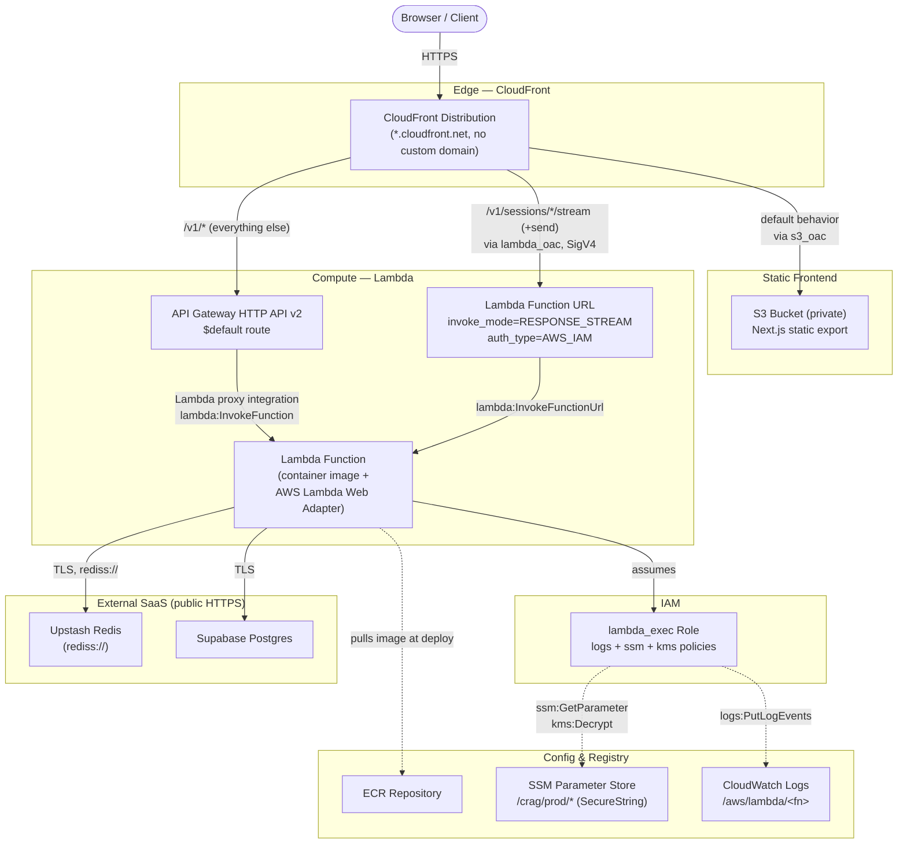

# Phase 15 — AWS Serverless Deployment: Step-by-Step

Scope: Lambda (container image) + API Gateway HTTP API + Lambda Function URL (streaming) + S3/CloudFront (frontend) + SSM Parameter Store + Upstash Redis, provisioned with Terraform, validated on LocalStack before real AWS. Full design/rationale lives in `plan.md`'s Phase 15 section and its Key Design Decisions table — this doc is the execution checklist only.

Status: **Stage A complete** (steps 1–5 below, all verified — see `completed.md`'s Phase 15 entry for exactly how). **Stage B is CLOSED** — both backend compute (Lambda + API Gateway + Function URL + IAM + SSM) and the frontend (S3 + CloudFront + two Origin Access Controls) are fully built and verified end-to-end against LocalStack (2026-07-08): a real register→login→create session→chat→persisted-message flow through the CloudFront distribution's own domain, hitting all three path-based behaviors (S3 static, API Gateway, streaming Function URL), plus a real browser test (not just curl) after tracking down an unrelated build-tooling bug (Git Bash/MSYS mangling a build-time env var — fixed, confirmed local dev and Docker Compose were never affected). Three real gaps were found and documented: one genuine cross-platform design gap (CloudFront's default `origin_read_timeout`, fixed by setting it to 60s — needed on real AWS too, not LocalStack-specific) and two LocalStack-only fidelity gaps (CloudFront Functions not executing at request time; LocalStack's own origin-forwarding proxy hardcoding a 30s timeout independent of that same setting, which is why the fix above still needs a first real-AWS proof for calls over 30s). None are code defects in this repo — all three are explicitly carried into Stage C as first-time real-AWS checks, see "Stage B — Frontend, built and verified" below. Nothing else is pending before starting Stage C. The LocalStack Ultimate trial is active as of 2026-07-08. Renumbered 2026-07-07 (was Phase 16) so this deploy target sits before CI (now Phase 17) and CD (Phases 18–19), not after — see `plan.md`'s Decision note.

---

## Architecture Overview



---

## Prerequisites

**Tooling**
- Terraform CLI
- AWS CLI
- Docker (already in use since Phase 10)
- LocalStack CLI + `tflocal` (or manual `endpoints {}` overrides in the Terraform AWS provider)

**Accounts**
- Real AWS account
- LocalStack account — **Ultimate trial activated 2026-07-08.** The free Hobby tier covers Lambda/S3/IAM/SSM/DynamoDB/REST API Gateway but **not** HTTP API Gateway or CloudFront, both used here. The trial window also needs to cover Phase 16's ECS/ALB later — don't let Stage B slip so long that it lapses before Phase 16 starts.
- Upstash Redis account (free tier), replacing ElastiCache — **provisioned and verified 2026-07-08** (`rediss://` TLS connection confirmed working against `redis-py`'s `from_url()`, no code changes needed; eviction policy set to `allkeys-lru` in the Upstash dashboard — `CONFIG GET` itself is restricted on managed Redis so can't be verified remotely, expected per `redis_setup.md`, not a gap)

**Locked decisions (not open for re-litigation, see `plan.md` for why)**
- Lambda Web Adapter, not Mangum
- Function URL (`RESPONSE_STREAM`) for chat/stream routes; HTTP API (v2) for everything else
- Next.js static export to S3 (not SSR/OpenNext)
- SSM Parameter Store (`SecureString`), not Secrets Manager
- Terraform remote state: S3 backend + DynamoDB lock table

---

## Stage A — Terraform scaffolding & app changes — **complete, 2026-07-08**

1. ✅ Create `infra/` Terraform root: `aws` provider pinned to a region, S3+DynamoDB backend for remote state, variables for account/region/secret names. **Done as two roots**, not one: `infra/bootstrap/` (local state) creates the state bucket + lock table themselves — solves the chicken-and-egg problem of an S3 backend needing a bucket that doesn't exist yet — then `infra/` (the app root) points its `s3` backend at what bootstrap created, via `-backend-config=backend-localstack.hcl` (partial backend config, since backend blocks can't reference variables). Both applied against LocalStack; `infra/`'s backend confirmed connected (`terraform plan` → "No changes"). Terraform 1.15.7 warned several S3-backend args used here (`dynamodb_table`, `endpoint`, `force_path_style`, etc.) are deprecated in favor of newer names (`use_lockfile`, `endpoints.s3`, `use_path_style`) — left on the older names since they still work and match the plan's locked "S3 + DynamoDB lock table" decision; flagged for whoever revisits this file.
2. ✅ Add the AWS Lambda Web Adapter layer to the backend `Dockerfile` (`AWS_LWA_INVOKE_MODE=RESPONSE_STREAM`, `PORT=8000`). Verified via `docker compose build backend && docker compose up` — `/health` still returns `{"status":"ok","db":true,"redis":true}`, identical startup log, confirming the adapter layer is a true no-op outside Lambda.
3. ✅ Add `boto3` to `backend/pyproject.toml`. In the `prod` extra (matches `fastapi`/`psycopg`/etc. — only needed when actually running the API). `uv sync` regenerated `uv.lock`; confirmed importable.
4. ✅ Update `config.py`'s `Settings` to read secrets via `boto3` SSM `get_parameter` calls at cold start when `APP_ENV=production`, falling back to `.env` locally — one class, two sources. **This step's own wording undersold the fix**: `Settings` alone wasn't enough, because `db/base.py`, `auth/jwt.py`, and `auth/dependencies.py` all read `os.environ[...]` directly at their own *import* time (a deliberate Phase 6 decision not to retrofit them), bypassing `Settings` entirely. The actual fix is a new `bootstrap_env()` in `config.py` that populates real `os.environ` (from SSM or `.env`, chosen by `APP_ENV`) — called from `api/main.py` in place of its old bare `load_dotenv()`, which is the one import choke-point every entrypoint passes through before those modules load. `Settings()` still works unchanged, since pydantic-settings prefers a real env var over its own `.env` read. New offline tests: `tests/phase15_deployment/test_config_bootstrap.py` (4 tests, no real AWS needed).
5. ✅ Frontend: switch to `output: "export"`, audit for any server-only Next.js features that would break under static export (check `AuthProvider`'s route guard is fully client-side — it should be already), build. **Two corrections found by actually building it, not assuming**: (a) `output` couldn't just be overwritten — Phase 10's Docker Compose deployment needs `"standalone"` (`frontend/Dockerfile` copies `.next/standalone`), so `next.config.ts` now reads `NEXT_OUTPUT_MODE` (defaults to `"standalone"`, opts into `"export"` only when set); (b) `app/chat/[sessionId]/page.tsx` was a dynamic route with no `generateStaticParams()` — unsupported under static export per Next's own bundled docs (`node_modules/next/dist/docs/.../static-exports.md`), and session UUIDs can't be enumerated at build time anyway. Resolved by converting it to `app/chat/page.tsx` reading `?sessionId=` via `useSearchParams()` (wrapped in `<Suspense>`, required by static export) — one static `/chat` HTML file instead of per-session files, no CloudFront custom-error-response workaround needed later. Verified: `NEXT_OUTPUT_MODE=export npm run build` succeeds, `out/` contains exactly the expected static files; `docker compose build frontend` still produces `.next/standalone` unchanged; full Playwright `chat.spec.ts` passed end-to-end against a real backend + real LLM call (register → create session → URL is `/chat?sessionId=...` → send message → get real streamed answer → rename → archive).

## Stage B — Validate on LocalStack

6. ✅ Activate the LocalStack Ultimate trial.
7. ✅ Point Terraform at the LocalStack endpoint (explicit provider `endpoints {}` overrides in `providers.tf` — no `tflocal` needed).
8. ✅ Build the adapter-enabled Docker image and push it to the LocalStack ECR-equivalent (`infra/scripts/push_image.sh` — a manual/script step; Terraform provisions the ECR repo but doesn't build or push images itself). **LocalStack-specific gotcha, not real-AWS**: a plain `docker push localhost:4566/...` doesn't work — ECR is a real Docker Registry v2 API, not a generic REST endpoint. Push to the wildcard hostname LocalStack answers on instead (`<registry-id>.dkr.ecr.<region>.localhost.localstack.cloud:4566`, resolvable via LocalStack's public `*.localstack.cloud` DNS with no `/etc/hosts` changes) — the script does this already.
9. ✅ Terraform apply against LocalStack — **backend and frontend resources, both complete**:
   - `aws_lambda_function` (image-based) — **built as two functions from the same image, not one** (see "Real gaps found" below for why)
   - `aws_lambda_function_url` (`RESPONSE_STREAM`) — **resolved**: `AWS_IAM`, confirmed working end-to-end against LocalStack (a real SigV4-signed `curl --aws-sigv4` request succeeded), and later confirmed reachable through CloudFront's `lambda_oac` too (see below).
   - `aws_apigatewayv2_api` + Lambda proxy integration + routes for non-streaming paths
   - IAM execution role scoped to `ssm:GetParameter` + CloudWatch Logs — one shared role, log-group ARN pattern widened to cover both functions (see below)
   - SSM `SecureString` parameters for every secret currently in `.env`
   - S3 bucket + CloudFront distribution — **built and verified**, see "Stage B — Frontend, built and verified" below
10. ✅ Set the Upstash Redis URL as the `REDIS_URL` SSM parameter value — confirmed the existing `redis-py` client in `cache/` connects over `rediss://` (TLS) with zero code changes, once the URL's scheme was actually `rediss://` (see gaps below).
11. ✅ Smoke test against LocalStack: register → login → create session → chat → SSE stream, verified through **both** invocation paths (buffered API Gateway and streaming Function URL) and confirmed both messages persisted to real Supabase Postgres.

### Real gaps found building Stage B's backend (2026-07-08), not assumed from the design docs

- **LocalStack wipes all state on container restart** — no persistence volume was configured. The bootstrap-created S3 state bucket + DynamoDB lock table, and everything Stage B had previously provisioned in an earlier pass, were simply gone when the container was restarted this session — `terraform plan` at the bootstrap layer showed 3 resources to (re)create even though local Terraform state believed they already existed. Recovery: re-apply `infra/bootstrap/`, then `terraform init -reconfigure` in `infra/` (its own remote-state object lived in that now-empty bucket too), then re-apply everything. Not a design flaw — LocalStack persistence is an opt-in feature not yet configured — but worth knowing before assuming a previous session's `apply` is still standing.
- **LocalStack's container-image Lambda executor requires an explicit Docker `ENTRYPOINT`.** The Stage A Dockerfile only set `CMD` (which AWS's own official Lambda Web Adapter examples do too, and which works fine on real AWS) — LocalStack 500s with `KeyError: 'Entrypoint'` if the image's `Config.Entrypoint` is unset. Fixed by splitting `CMD ["uv", "run", "python", "run_api.py"]` into `ENTRYPOINT ["uv", "run", "python"]` + `CMD ["run_api.py"]` — functionally identical when run with no override args, verified as a true no-op locally (`docker compose up`, `/health` unchanged) before pushing to LocalStack.
- **`uv run`'s cache directory isn't writable inside a Lambda execution environment.** Both real Lambda and LocalStack's emulation only guarantee `/tmp` as writable; LocalStack runs the entrypoint as a sandboxed non-root user (`sbx_user1051`) whose home directory doesn't exist/isn't writable, so `uv run` failed with `Permission denied: /home/sbx_user1051/.cache/uv`. Fixed with `ENV UV_CACHE_DIR=/tmp/uv-cache` in the Dockerfile.
- **The Chroma vector store was never actually inside the deployed image at all** — `backend/.dockerignore` excluded `.chroma`/`multi_agent/.chroma` outright, and Docker Compose only ever worked because it bind-mounts the host's `.chroma` directory over that path (a trick with no Lambda equivalent). This was a latent gap since Phase 10, not Lambda-specific — a plain `docker build` without Compose's bind mount would have shipped an empty vector store all along. Fixed two ways: (1) removed the `.chroma` exclusions from `.dockerignore` so the real, already-ingested collection gets baked into the image; (2) since Lambda's root filesystem is read-only outside `/tmp` (so even a baked-in copy can't be opened read-write by Chroma's sqlite backend in place), `multi_agent/ingestion.py` now reads an optional `CHROMA_PERSIST_DIR` env var and, if set, copies the baked-in seed directory there on cold start before handing that path to `Chroma(...)`. Unset everywhere except the Lambda functions (`infra/lambda.tf` sets it to `/tmp/chroma`), so local dev/Compose/tests are unaffected — verified via a quick `uv run python -c "from multi_agent.ingestion import ..."` showing the exact same persist path as before.
- **One Lambda function cannot correctly serve both a buffered API Gateway integration and a `RESPONSE_STREAM` Function URL** — a real architecture gap in this doc's and `plan.md`'s original design, not just a LocalStack quirk. `AWS_LWA_INVOKE_MODE` is a single per-function environment variable that controls the adapter's output format; API Gateway's HTTP API integration always uses a classic buffered `Invoke` (never `InvokeWithResponseStream`) and cannot parse the adapter's streaming-format output (a JSON prelude, 8 null bytes, then the body) — confirmed by actually invoking a single shared function through LocalStack's API Gateway emulation and seeing exactly that malformed body. This would fail identically on real AWS, not just LocalStack. **Fixed by deploying two Lambda functions from the same ECR image** (`infra/lambda.tf`): `aws_lambda_function.backend` (no `AWS_LWA_INVOKE_MODE` override, defaults to buffered, fronted by API Gateway) and `aws_lambda_function.backend_stream` (`AWS_LWA_INVOKE_MODE=RESPONSE_STREAM` set only in its own Terraform environment block, fronted only by the Function URL). Both share the one `lambda_exec` IAM role; its logs policy's `Resource` ARN was widened from `.../−backend:*` to `.../−backend*:*` (trailing wildcard, not a literal suffix) to cover both functions' log groups without duplicating the role.
- **Upstash's connection string scheme mistake recurred**: `infra/secrets.auto.tfvars`'s `REDIS_URL` was pasted as `redis://` instead of `rediss://` (TLS) — the exact mistake `completed.md`'s Phase 15 entry already documented from Stage A, now repeated because the real URL had to be re-entered from scratch (it's intentionally never persisted anywhere per that same entry). Worth remembering this needs re-verifying by eye every time the value is re-pasted, not just the first time.
- **Real, measured proof of why the Function URL/API Gateway split matters**: the actual CRAG pipeline's chat/stream smoke-test call took **31.4 seconds** end-to-end (real OpenAI + Tavily + Supabase + Upstash calls) — longer than API Gateway's 29-second hard integration timeout. Routed through the Function URL, it succeeded; the same call through API Gateway would have hard-failed. This is exactly the risk `plan.md`'s Key Design Decisions table cites as the reason for the Function URL's existence, now confirmed with a real measurement rather than a theoretical concern.

### Stage B — Frontend, built and verified end-to-end — CLOSED (2026-07-08)

`infra/s3.tf` (private bucket, all four public-access-block settings on, bucket policy scoped to the distribution's own ARN via `AWS:SourceArn`) and `infra/cloudfront.tf` (`s3_oac` + `lambda_oac` Origin Access Controls, two self-defined cache policies + one origin-request policy, a CloudFront Function for extensionless-URL rewriting, and the distribution itself — default behavior → S3, `/v1/sessions/*/messages` + `/v1/sessions/*/stream` → the streaming Function URL, everything else under `/v1/*` → the HTTP API) now exist. `infra/scripts/sync_frontend.sh` pushes `frontend/out/` (rebuilt with `NEXT_PUBLIC_API_BASE_URL=/v1`, a same-origin relative path, not the Stage A build's `localhost:8000` absolute URL) to the bucket.

**The open OAC-to-Function-URL question is resolved**: LocalStack's CloudFront OAC *can* sign requests to a Lambda Function URL origin — confirmed by sending a real chat message through the CloudFront domain and getting a real OpenAI-generated answer back, and by streaming a real SSE response through the same path.

**Three real gaps found building this, not assumed:**
- **CloudFront Function `viewer-request` associations are not executed by LocalStack's CloudFront emulation.** `GET /login` (the browser-visible URL for `out/login.html`) 404s; `GET /login.html` directly 200s. LocalStack's own container logs show the unrewritten URI being forwarded to S3 — the `aws_cloudfront_function` resource and its association are accepted by `terraform apply` without error, they just never fire at request time. This is a LocalStack limitation (CloudFront Functions are a real, working AWS feature) — the fix is a documentation flag for Stage C (verify plain-URL browsing there), not a code change.
- **CloudFront's own default `origin_read_timeout` (30s) sits right at the CRAG pipeline's measured 31.4s latency** — fronting the already-fixed Function URL split through CloudFront would have silently reintroduced the exact timeout class the split exists to avoid, one hop further out. Caught by an actual `ReadTimeout` at 30s sending a chat message through the full CloudFront path. Fixed with `origin_read_timeout = 60` on the `lambda-stream` origin's `custom_origin_config`, matching the Lambda functions' own 60s timeout.
- **LocalStack's CloudFront-to-custom-origin forwarding hardcodes its own 30s read timeout, independent of `origin_read_timeout`.** Re-running the chat smoke test a second time (2026-07-08, after unrelated local/Compose regression testing) hit the identical `ReadTimeout` at exactly 30s again — despite `terraform plan` showing zero drift, confirming `origin_read_timeout = 60` really is set on the distribution as designed. LocalStack's own container log pinpoints the actual cause: `l.aws.handlers.logging : exception during call chain: E(host='...lambda-url...', port=4566): Read timed out. (read timeout=30)` — LocalStack's internal HTTP client used to forward CloudFront-to-origin requests has its own hardcoded 30s timeout that doesn't read the distribution's configured value at all. No LocalStack container env var for this was found (`docker exec localstack-main printenv | grep -i timeout` — nothing). **This means `origin_read_timeout = 60` cannot be fully verified end-to-end on LocalStack for calls landing between 30–60s** (calls under 30s succeed regardless, calls over 30s fail regardless of the Terraform setting) — the setting itself is still correct and necessary, and real AWS CloudFront does honor `origin_read_timeout`; this is purely a LocalStack fidelity ceiling to re-confirm once on real AWS (Stage C), alongside the CloudFront Function gap above.

**Verified for real, through the CloudFront domain itself** (not the backend directly): register → login → create session → real chat message via the OAC-signed Function URL (7s warm) → message history via API Gateway → a real SSE stream via the Function URL. Static delivery from S3 via `s3_oac` confirmed (root `/`, direct `.html` paths, `_next/static/*` assets all 200, `x-amz-server-side-encryption` present confirming OAC signing on that origin too). **Caveat**: that chat message succeeded at 7s (under LocalStack's hardcoded 30s origin-forwarding ceiling, see the third gap above) — a slower call through the identical path hit that ceiling on a later re-run, so "verified end-to-end" here covers calls under 30s specifically, not the 31–60s range `origin_read_timeout = 60` actually exists for.

## Stage C — Real AWS

12. Re-point the same Terraform config at real AWS (swap provider/backend config; resource definitions unchanged).
13. Build and push the real image to the real ECR repo.
14. `terraform apply` against real AWS.
15. Run the same manual smoke test against the live CloudFront URL — **including a plain-browser check of `/login`, `/register`, `/chat` with no `.html` suffix** (the CloudFront Function gap) **and a chat message that takes 30–60s end-to-end** (the origin-read-timeout gap) — both were accepted/configured correctly by LocalStack's `terraform apply` but Stage B could not confirm either actually behaves as designed there; real AWS needs to verify both for the first time.
16. `curl -N` (or equivalent) directly against the Function URL — confirm chunks arrive incrementally, not buffered.
17. Cold-start latency spot check.
18. Confirm the auth rate limiter (Phase 12) and the Redis-down fail-open behavior (Phase 3/4) still hold, now against real Upstash instead of `fakeredis`/local Redis.
19. Failure-path test: temporarily break the Upstash URL, confirm the same graceful-degrade behavior from Phase 4/6 holds against a real HTTP-based client.

## Stage D — Wrap-up

20. Document `terraform destroy` as the default between demos — nothing here should be left running 24/7 by accident.
21. Update `completed.md` / `plan.md` phase status once verified end-to-end.

---

## Open questions surfaced during this pass

- Lambda Function URL auth type + whether CloudFront OAC works with a Function URL origin (see Stage B, step 9) — needs a decision before that step, not during. **Resolved below** (design decision), **and confirmed working for real against LocalStack 2026-07-08** — see Stage B's frontend section above.
- Whether CI should be built first, deferred, or skipped for this deployment pass — **resolved 2026-07-07**: CI is now Phase 17, sequenced after both deploy phases (15/16) rather than before, so it's not a blocker for starting here — see `plan.md`.
- Whether `app/chat/[sessionId]` (a dynamic route keyed on arbitrary runtime session UUIDs) could survive static export at all — surfaced during Stage A step 5, not anticipated when this doc was written. **Resolved 2026-07-08**: converted to `/chat?sessionId=` (query param, `useSearchParams()`), not kept as a path segment with a `generateStaticParams()` placeholder + CloudFront custom-error-response fallback — the query-param route needs zero CloudFront-side special-casing later, at the cost of a slightly less clean URL. See `completed.md`'s Phase 15 entry for the two options that were weighed.

---

## Resource Wiring Detail: IAM roles, security boundaries, inputs/outputs (added 2026-07-07, design only)

Fills in the permissions/roles/wiring left implicit in Stage A/B above. Written design-first; everything in this table is now built and verified — see Stage B's backend and frontend sections above.

**No VPC, therefore no security groups.** Lambda deliberately stays outside a VPC in this phase (Phase 16's Fargate reuses a VPC "unlike the Lambda in Phase 15, which deliberately avoided one" — `plan.md`), and API Gateway HTTP API, CloudFront, and S3 are never VPC-attached either. Nothing in this phase has a security group. The perimeter is instead three things: **identity-based IAM policies** (attached to the Lambda execution role — what the function may call outward), **resource-based policies** (attached to the Lambda function, the Function URL, and the S3 bucket — who may call in), and **auth-type flags** (the Function URL's `NONE` vs `AWS_IAM`). Phase 16's ALB + ECS task security groups are the first place in this project's AWS work where a security group actually applies.

**Per-resource IAM / resource policy / wiring table:**

| Resource (Terraform type) | IAM or resource policy attached | Inputs (← from) | Outputs (→ consumed by) |
|---|---|---|---|
| tfstate bucket + versioning (`aws_s3_bucket`) | Bucket policy restricting access to the operator/CI IAM principal only | — (bootstrapped first, by hand or a throwaway local-backend apply) | referenced in every other resource's `backend "s3" {}` block |
| lock table (`aws_dynamodb_table`, `hash_key = "LockID"`, pay-per-request) | none of its own; operator/CI role needs `dynamodb:GetItem/PutItem/DeleteItem` scoped to its ARN | — | used implicitly by Terraform during every `apply`/`plan` |
| backend image repo (`aws_ecr_repository`) | none needed for same-account pulls — Lambda can pull from an ECR repo in the same account/region automatically; a repository policy is only needed cross-account | — | `repository_url` → image push target (script step) and → Lambda function's `image_uri` |
| `lambda_exec` role (`aws_iam_role`) | trust policy: only `lambda.amazonaws.com` may `sts:AssumeRole`. Three scoped inline policies attached — see below | — | `arn` → Lambda function's `role` |
| function log group (`aws_cloudwatch_log_group`, explicit `retention_in_days`) | — | name must match `/aws/lambda/<function_name>`, which the logs policy below scopes to | avoids Lambda's default auto-created group (infinite retention) |
| backend function (`aws_lambda_function`, `package_type = "Image"`) | runs as `lambda_exec` role | `role` ← lambda_exec.arn; `image_uri` ← ECR repo `repository_url` + pushed tag | `function_name`/`arn` → its own `aws_lambda_permission` resources and the Function URL; `invoke_arn` → API Gateway integration |
| API Gateway → Lambda permission (`aws_lambda_permission`, resource-based, not a role) | principal `apigateway.amazonaws.com`, `source_arn = "${api.execution_arn}/*/*"` | `function_name` ← Lambda; `source_arn` ← API Gateway `execution_arn` | this, not an IAM role, is what actually lets API Gateway invoke the function |
| streaming Function URL (`aws_lambda_function_url`, `invoke_mode = RESPONSE_STREAM`) | `auth_type = "AWS_IAM"` — resolves the open question above | `function_name` ← Lambda | `function_url` (host) → CloudFront's streaming-behavior origin |
| CloudFront → Function URL permission (`aws_lambda_permission`, resource-based) | `action = "lambda:InvokeFunctionUrl"`, principal `cloudfront.amazonaws.com`, `source_arn` = CloudFront distribution ARN, `function_url_auth_type = "AWS_IAM"` | `source_arn` ← CloudFront distribution `arn` | together with the Function URL's `AWS_IAM` auth type, this is the entire perimeter around the streaming path |
| HTTP API + integration + `$default` route + stage (`aws_apigatewayv2_*`) | no IAM role on the API itself — the Lambda-side resource policy above is the only gate; HTTP API v2 has no resource-policy equivalent to REST API's | `integration_uri` ← Lambda `invoke_arn`; `payload_format_version = "2.0"` | `api_endpoint` → CloudFront's `/v1/*` origin; `execution_arn` → the API-Gateway-to-Lambda permission above |
| SSM parameters, one per `.env` secret (`aws_ssm_parameter`, `for_each`, `type = SecureString`) | governed entirely by `lambda_exec`'s ssm + kms policies below — nothing else reaches these | path prefix `/crag/prod/<KEY>` | read at cold start by `config.py`'s `Settings` via `boto3 get_parameter(WithDecryption=True)` — a runtime edge, not a Terraform-graph one |
| CloudFront domain SSM parameter (`aws_ssm_parameter.cloudfront_domain`, `type = String`, **added 2026-07-11, not yet applied** — see "Follow-Up" below) | governed by `cd-lambda-deploy-role`'s own `ssm:GetParameter` grant (Phase 18's infra, not this stack's) — no relation to `lambda_exec`'s policies above | `value` ← `aws_cloudfront_distribution.this.domain_name` | read by `cd-lambda.yml`'s smoke-check step via the AWS CLI — a CI-time edge, not a runtime-app edge like the row above |
| frontend bucket (`aws_s3_bucket` + `aws_s3_bucket_policy`) | bucket policy: principal `cloudfront.amazonaws.com`, `Condition.StringEquals["AWS:SourceArn"]` = CloudFront distribution ARN. All four block-public-access settings on | `bucket_regional_domain_name` used by CloudFront's default origin | policy's `AWS:SourceArn` ← CloudFront distribution `arn` |
| two Origin Access Controls (`aws_cloudfront_origin_access_control`) — `s3_oac` and `lambda_oac` | — | `s3_oac`: `origin_type = "s3"`; `lambda_oac`: `origin_type = "lambda"`, `signing_protocol = "sigv4"` | used by the distribution's S3 and Function URL origins respectively |
| CloudFront distribution (`aws_cloudfront_distribution`, default `*.cloudfront.net` domain, no ACM/custom domain this phase) | no IAM role; access to each origin is governed by that origin's own resource policy (above) | three origins: default → S3 (via `s3_oac`); `/v1/sessions/*/stream` (+ sync send route) → Function URL host (via `lambda_oac`, caching disabled, all headers/query strings/cookies forwarded); everything else under `/v1/*` → API Gateway `api_endpoint` | `domain_name` is the terminal output (the app's public URL); `arn` feeds back into the Lambda-permission and S3-bucket-policy `source_arn` conditions above |
| Upstash Redis, Supabase Postgres (not Terraform-managed, not AWS) | none — access control is a token/password embedded in the connection URL (`rediss://` for Upstash); no VPC peering or PrivateLink since Lambda isn't in a VPC to peer from | — | connection URLs are stored as the *values* of two SSM parameters above — that's their only touchpoint with this infrastructure |

**Lambda execution role — the three scoped policies** (deliberately not the AWS-managed `AWSLambdaBasicExecutionRole`, so the role stays self-documenting):

1. **Logs** — `logs:CreateLogGroup`, `CreateLogStream`, `PutLogEvents`, scoped to `arn:aws:logs:*:*:log-group:/aws/lambda/<function-name>:*`.
2. **SSM** — `ssm:GetParameter`, `GetParametersByPath`, scoped to `arn:aws:ssm:*:*:parameter/crag/prod/*`. Read-only — the function never writes secrets.
3. **KMS** — `kms:Decrypt` on the key behind `alias/aws/ssm` (the default AWS-managed key; no customer-managed key needed at this scale). **Easy to miss:** `ssm:GetParameter` alone is not sufficient for `SecureString` parameters — SSM makes a KMS `Decrypt` call under the caller's identity, so without this the function 403s on every secret read at runtime, not at `terraform apply` time.

**Open question resolved:** use `AWS_IAM`, not `NONE`, for the Function URL's `auth_type`. CloudFront added Origin Access Control support for Lambda Function URL origins in 2023, so OAC can sign requests to a Function URL the same way it already does for S3. `NONE` would leave the URL invokable by anyone on the internet who finds it, with no reason to accept that once OAC is available. **LocalStack fidelity confirmed 2026-07-08**: a real chat message and a real SSE stream both succeeded through CloudFront's `lambda_oac`-signed origin — see Stage B's frontend section above.

**Operator/CI permissions** (separate from any resource's own role — this is what your own IAM user/CLI profile needs to run `terraform apply` at all): S3 + DynamoDB CRUD on the state bucket/lock table; ECR `GetAuthorizationToken` + push actions; IAM `CreateRole`/`PutRolePolicy`/**`PassRole`** (the last one specifically — Terraform needs permission to hand the `lambda_exec` role to the Lambda function at creation time, a common source of an unexplained `apply`-time 403 if scoped too tight); standard Create/Update/Delete actions on lambda, apigateway, cloudfront, ssm, s3, and logs, since Terraform is what's provisioning all of them.

**Full wiring order** (the sequence Terraform actually needs things to exist in, tracing every output→input edge above): state bucket/lock table exist → ECR repo created, image built and pushed (script, not Terraform) → `lambda_exec` role + its three policies → SSM parameters (no dependency on the role, only the role's policy path prefix depends on their naming convention) → Lambda function (needs role + image) → HTTP API + integration (needs `invoke_arn`) → the API-Gateway-to-Lambda permission closes that loop (needs `execution_arn`) → Function URL created with `AWS_IAM` auth → frontend bucket created (policy attached later) → both OACs created → CloudFront distribution (needs the S3 domain, Function URL host, and `api_endpoint`) → the CloudFront-to-Function-URL permission and the S3 bucket policy both close their loops back to the now-existing distribution ARN → `domain_name` is the finish line used for the Stage B/C smoke test.

---

## Follow-Up (added 2026-07-11; applied and verified 2026-07-12, see the dated section below): CloudFront domain → SSM, for the CD dispatcher

Everything above this section predates the Phase 18/19/21 CD dispatcher design (`cd-dispatcher-steps.md`) and is left as-is, per this doc's own convention of not silently editing completed sections in place. This is a new, small, additive infra change surfaced by that later design work — not part of Stage A/B's original scope, and not yet applied to either the closed LocalStack Stage B environment or (not yet reached) Stage C real AWS.

**Why:** `cd-lambda.yml` (Phase 18, see `cd-lambda-deploy-steps.md`) needs this distribution's domain at deploy time to run its post-deploy smoke check. It can't read Terraform state directly (a GitHub Actions runner has no access to this stack's state), and the domain can't be a static GitHub repository Variable either — this phase deliberately has no custom domain (see the CloudFront distribution resource's own comment, and `plan.md`'s Cost Profile follow-up), so the auto-generated `*.cloudfront.net` hostname changes every time the distribution is torn down and recreated. `outputs.tf`'s existing `cloudfront_domain_name` output already surfaces this value for a human running `terraform apply` by hand — this adds a second, machine-readable path to the same value for a caller with no Terraform state access at all.

**Add to `infra/lambda-gate/ssm.tf`** (new resource, alongside the existing `secrets` `for_each` block):

```hcl
# Not a secret, unlike the block above — the CD dispatcher's smoke-check step
# (cd-lambda-deploy-steps.md) reads this via `aws ssm get-parameter`, since a
# GitHub Actions runner has no access to this stack's Terraform state and the
# domain can't be a static GitHub Variable (no custom domain this phase, so
# the auto-generated hostname changes on every destroy/reapply).
resource "aws_ssm_parameter" "cloudfront_domain" {
  name  = "/${var.project_name}/${var.environment}/cloudfront_domain"
  type  = "String"
  value = aws_cloudfront_distribution.this.domain_name
}
```

`type = "String"`, not `SecureString` like the `secrets` block — this value isn't sensitive (it's the same domain the app is already publicly served on), and plain `String` parameters are also what SSM's free Standard-tier allotment covers most generously. Resolves to `/crag/prod/cloudfront_domain`, matching what `cd-lambda-deploy-steps.md`'s step 2 already grants `cd-lambda-deploy-role` read access to (`ssm:GetParameter` scoped to this one parameter, added to that role's own permissions, not this stack's — the *writer* lives here, the *reader*'s IAM grant lives in Phase 18's infra).

**When to apply:** before Phase 18 is built — its smoke-check step has nothing to read otherwise. This is a purely additive resource (doesn't touch or recreate anything existing), so `terraform apply` picks it up alongside whatever else changes at that point; no need to apply it in isolation first. Re-applying it against the already-closed LocalStack Stage B environment specifically is optional and not required for Phase 18/19 to function — GitHub Actions CD workflows target real AWS only (see `cd-dispatcher-steps.md`'s scope note), so this parameter only needs to exist for real once Stage C happens, not on LocalStack.

---

## Verified (2026-07-12): Follow-Up applied and tested against a fresh LocalStack instance

The Follow-Up above was written 2026-07-11 as design-only, explicitly not yet applied. It has since been applied and tested for real, alongside a full independence re-verification against `infra/fargate/` (own equivalent note in `grand-enterprize-deploy-steps.md`). Full detail lives in `completed.md`'s Phase 15 entry — summarized here:

- LocalStack's container had been restarted since the prior verification pass (persistence disabled — same recurring gap already documented above) — recovered via the standard `infra/bootstrap` re-apply + `terraform init -reconfigure` + full re-apply sequence, run for both `infra/lambda-gate/` and `infra/fargate/` in the same pass specifically to test independence, not just to get back to a working state.
- `aws_ssm_parameter.cloudfront_domain` applied cleanly alongside the other 34 resources (35 total, `0 changed`/`0 destroyed`). Resolved to `/crag/prod/cloudfront_domain`, confirmed via `aws ssm get-parameter` and confirmed distinct from `infra/fargate/`'s own `/crag/prod-ecs/cloudfront_domain` — `aws ssm get-parameters-by-path` against both prefixes returned 10 non-overlapping parameters each, no collision.
- Full app flow re-verified through this stack's own CloudFront domain: register → login → create session → a real chat message (CRAG graph run, real OpenAI answer, persisted to Supabase Postgres) — succeeded end-to-end. One call to `/v1/sessions/{id}/messages` did hit LocalStack CloudFront's ~30s origin-proxy timeout (a `ReadTimeout`, not an app error); calling the Function URL directly confirmed the backend itself completed the same call in 11s. This is the same pre-existing LocalStack fidelity gap already flagged in step 15's Stage C list above and in `completed.md`'s Phase 15 Stage B entry — recurred again, not new, and not something Terraform can fix.
- The frontend S3 bucket was found empty this session (the static export was never synced in this particular verification pass) — rebuilt with `MSYS_NO_PATHCONV=1 NEXT_OUTPUT_MODE=export NEXT_PUBLIC_API_BASE_URL=/v1 npm run build` and re-synced via `sync_frontend.sh`; `/login.html` confirmed 200 afterward. The CloudFront-Function extensionless-URL-rewrite gap recurred identically (a further occurrence of the same LocalStack limitation) — same `.html`-suffix workaround used.
- A test user created for this pass (`crag-verify-lambda-20260712@example.com`) was deleted afterward directly from Postgres (`DELETE FROM users WHERE email = ...`, cascading to its session/messages via the existing `ON DELETE CASCADE` FKs) — verified empty post-delete, confirmed no effect on the ~70 pre-existing users left over from earlier verification sessions.

Net effect: the design in the Follow-Up section above is now closed, not just planned — `cd-lambda.yml` (Phase 18, once built) has a real, tested SSM parameter to read.
