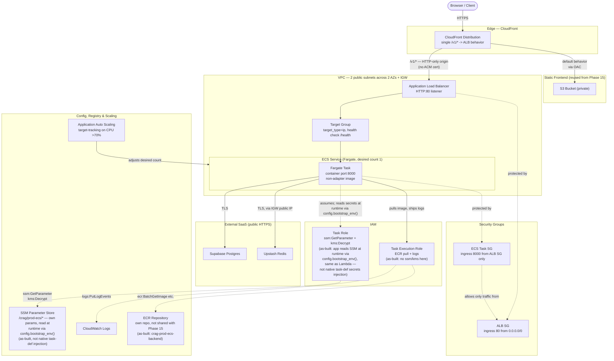

# Phase 16 — AWS Container Deployment: ECS Fargate — Step-by-Step

Scope: ECS Fargate + Application Load Balancer + simplified CloudFront (single ALB origin, no more Function-URL/HTTP-API split) + the same Upstash/Supabase choices as Phase 15, provisioned with Terraform, validated on LocalStack before real AWS. Full design/rationale lives in `plan.md`'s Phase 16 section and Key Design Decisions table — this doc is the execution checklist only. Companion to [`enterprize-deploy-steps.md`](./enterprize-deploy-steps.md) (Phase 15), which this phase was originally planned to build directly on top of — **see the "Actually Built" section at the end of this doc**: that plan changed during implementation, this phase ended up fully independent of Phase 15's stack instead.

Status: **Stage A/B complete and verified end-to-end on LocalStack, including a real browser test — 2026-07-10.** Stage C (real AWS) not started. See `completed.md`'s Phase 16 entry for the authoritative record of what was actually built, including every deviation from this doc's original design and every real gap found; this doc's step lists below are left largely as originally written (the design intent going in), with the divergences called out explicitly in the "Actually Built" section at the end rather than silently edited in place. Renumbered 2026-07-07 (this deploy target was formerly Phase 17) so both AWS deploy targets (Phase 15, this Phase 16) sit before the CI/CD phases (17–19) instead of interleaved with them. **Note: the "hard prerequisite: Phase 15 must already be applied" line below describes the original plan, not what was built** — the built version has no dependency on `infra/lambda-gate/` at any layer (own ECR repo, own SSM parameters, own S3 bucket, own scripts). It does still reuse Phase 15's LocalStack Ultimate trial window, Upstash Redis instance, and Supabase Postgres connection — those genuinely are shared, just not through Terraform state or IAM.

---

## Architecture Overview



---

## Prerequisites

**Tooling** — same as Phase 15: Terraform CLI, AWS CLI, Docker, LocalStack CLI + `tflocal`.

**Accounts / state carried over from Phase 15**
- The same LocalStack Ultimate trial window from Phase 15 — this phase depends on it too (ECS and ALB both need Base tier or higher; Base itself is sufficient for both, see the Phase 15 pricing check — but the plan's free path is Ultimate's trial). If that trial has already lapsed, `plan.md` documents its own fallback: skip LocalStack entirely and iterate directly against real AWS in a tight `apply` → smoke-test → `destroy` loop (~$1/day, cheaper than a Base subscription just to validate locally).
- Phase 15's ECR repo, SSM parameters, Upstash Redis instance, and Supabase Postgres connection — all reused unchanged, not rebuilt.

**New for this phase**
- A load-testing tool to drive the autoscaling verification step — `plan.md` doesn't name one; pick something lightweight (`hey`, `ab`, or a small `k6`/`locust` script) before Stage C.

---

## Stage A — Image & Terraform scaffolding

1. Add a second image build path that omits the Lambda Web Adapter layer — plain `CMD ["python", "run_api.py"]`, real `uvicorn` behind a real load balancer. `plan.md` says Phase 16 reuses "the same ECR image built for Lambda, minus the Lambda Web Adapter layer" — since one Dockerfile can't conditionally include/exclude a layer at run time, this needs an actual second build target (multi-stage Dockerfile stage, or a build-arg toggle, or a second Dockerfile e.g. `Dockerfile.ecs`). Decide the mechanism here, not while writing the ECS task definition.
2. Decide whether Phase 16's ECS/ALB resources go into Phase 15's existing `infra/` Terraform state, or a separate state file that references Phase 15 via remote state data sources. Either works; `plan.md` doesn't mandate one — pick based on how independently you want to be able to `destroy` each phase.
3. Decide the VPC: reuse Phase 15's VPC (simpler, one less thing to manage) or size a new minimal one (cleaner separation, but Fargate always needs *a* VPC — Lambda in Phase 15 deliberately avoided needing one at all, so if Phase 15 never provisioned a VPC, this phase creates the first one). Either way: public subnets + Internet Gateway route for the Fargate task's public IP, not a private subnet + NAT Gateway (cost-driven, same reasoning as Phase 15's Lambda-out-of-VPC choice).
4. Add IAM for ECS: a **task execution role** (ECR image pull, CloudWatch Logs, and — if using ECS-native secret injection, see Stage B step 6 — `ssm:GetParameters` scoped to the specific parameter ARNs), and a **task role** only if the app needs to call AWS APIs itself at runtime beyond secret injection (it currently doesn't).

## Stage B — Validate on LocalStack (same trial window as Phase 15)

5. Confirm the Ultimate trial from Phase 15 is still active. If it's expired, skip straight to Stage C using the real-AWS iteration loop instead.
6. Build and push the non-adapter image variant to the (LocalStack) ECR repo under its own tag (e.g. `:ecs` alongside Phase 15's `:lambda`).
7. Terraform apply against LocalStack:
   - `aws_ecs_cluster`
   - `aws_ecs_task_definition` — 0.25 vCPU / 0.5 GB, container port 8000, secrets wired from SSM. **Decide the injection mechanism here**: ECS task definitions support native `secrets` (resolves SSM/Secrets Manager values straight into container env vars at task start, no app code needed) — this is actually simpler than Phase 15's approach, where the `boto3`-in-`config.py` path exists specifically because *Lambda* has no equivalent native SSM-to-env-var resolution. Using ECS-native secrets here means `config.py` can likely just read plain env vars for this deployment target, with the `boto3` branch staying Lambda-specific rather than generically "production." Worth resolving before writing the task definition, since it changes what `config.py` needs to do.
   - `aws_ecs_service` — Fargate launch type, desired count 1, public IP enabled, attached to the target group
   - `aws_lb` (ALB) + target group (health check on `/health`) + listener. **Open decision**: `plan.md` says "HTTPS listener," but Phase 15 deliberately skipped a custom domain/ACM certificate (using CloudFront's default domain to stay free). An ALB HTTPS listener needs its own ACM certificate bound to a real domain, which isn't provisioned anywhere in the plan. If the ALB is only ever reached through CloudFront (which already terminates public HTTPS on its own default domain), the ALB itself can run an **HTTP-only listener on port 80**, with CloudFront's origin-protocol-policy set to HTTP-only or match-viewer — avoiding the need for a domain/cert entirely. Decide this before writing the listener resource.
   - Security groups: ALB's SG open on whichever port the listener above ends up using; the ECS task's SG only accepts traffic from the ALB's SG (never open directly to the internet)
   - `aws_appautoscaling_target` + `aws_appautoscaling_policy` — target-tracking on CPU (e.g. scale out above 70%)
8. CloudFront: update the distribution from Phase 15 (or recreate it under LocalStack) — collapse the old Function-URL-vs-HTTP-API path split into a single `/v1/*` → ALB behavior; the S3 frontend origin carries over unchanged.
9. Smoke test against LocalStack: register → login → create session → chat → SSE stream — same flow as Phase 15.

## Stage C — Real AWS

10. Point Terraform at real AWS (same provider/backend swap pattern as Phase 15).
11. Build and push the real non-adapter image to the real ECR repo, under its own tag.
12. `terraform apply` against real AWS.
13. Run the same manual smoke test against the live CloudFront URL.
14. Confirm the SSE stream is genuinely token-by-token-shaped end-to-end **with no adapter layer involved** — this is the one check worth doing distinctly from Phase 15, since removing the Lambda Web Adapter workaround entirely is the actual point of this phase.
15. Re-run the same Redis/DB failure-path checks as Phase 15 (Upstash down, DB down → documented graceful degrade, not a crash).
16. Load-balancer health-check failure test: stop the running task manually, confirm the ALB marks the target unhealthy and stops routing to it.
17. Autoscaling verification: drive a synthetic CPU-heavy load against the service with the tool picked in Prerequisites, confirm the target-tracking policy actually launches a second task.

## Stage D — Wrap-up

18. `terraform destroy` between demos, same discipline as Phase 15 — but note the different cost shape: the ALB bills hourly (~$16–20/month) from the moment it exists, unlike Phase 15's fully pay-per-use Lambda stack. "Leave it running overnight without thinking about it" is not safe here the way it arguably was for Phase 15.
19. Update `completed.md` / `plan.md` phase status once verified end-to-end.

---

## Open questions surfaced during this pass

- **ALB listener protocol/cert** (Stage B, step 7) — HTTPS needs an ACM cert + real domain not provisioned anywhere in the plan; HTTP-only behind CloudFront is the likely simpler path but isn't what the plan's wording implies. **Resolved below.**
- **Secret injection mechanism** (Stage B, step 7) — ECS-native `secrets` (no app code, task-definition-level) vs. reusing Phase 15's `boto3`-in-`config.py` path. ECS supports the former natively; Lambda doesn't, which is *why* Phase 15 needed the `boto3` workaround in the first place. Worth simplifying `config.py` once this is decided, rather than carrying Lambda's workaround into a platform that doesn't need it. **Resolved below.**
- **Shared vs. new VPC** (Stage A, step 3) — `plan.md` phrases this as "reuse Phase 15's VPC (or a minimally-sized new one)" without picking one; decide based on whether Phase 15 ends up provisioning a VPC at all. **Resolved below.**
- **Load-testing tool** for the autoscaling check (Stage C, step 17) — not named in `plan.md`; pick one before you get there. **Resolved below.**

---

## Resource Wiring Detail: IAM roles, security groups, inputs/outputs (added 2026-07-07, design only)

Fills in the permissions/roles/SGs/wiring left implicit in Stage A/B above, and closes the four open questions. Nothing here is built yet — this is what to implement against, resource by resource, once Phase 15 is standing. Companion to the equivalent section in [`enterprize-deploy-steps.md`](./enterprize-deploy-steps.md) (Phase 15) — read that one first for the "why no security groups exist there," since this phase is where they first show up in this project's AWS footprint.

**This phase introduces the project's first VPC and its first security groups.** Phase 15's Lambda deliberately stayed out of a VPC entirely; Fargate cannot — `awsvpc` networking mode requires every task to sit in a subnet with an attached ENI. Resolving the open "shared vs. new VPC" question: since Phase 15 provisions no VPC at all, there is nothing to share — **Phase 16 creates a new, minimal VPC** here: one VPC, two public subnets in two different AZs (an ALB requires subnets in at least two AZs, even for a single-task service), one Internet Gateway, one route table with a `0.0.0.0/0 → igw` route attached to both public subnets. No private subnets, no NAT Gateway — the task gets a public IP directly, same cost reasoning as Phase 15's Lambda-out-of-VPC choice.

**Per-resource IAM / security-group / wiring table:**

| Resource (Terraform type) | IAM role or security group | Inputs (← from) | Outputs (→ consumed by) |
|---|---|---|---|
| VPC + 2 public subnets + IGW + route table (`aws_vpc`, `aws_subnet` ×2, `aws_internet_gateway`, `aws_route_table`) | — | — | subnet IDs → ALB + ECS service `network_configuration`; VPC ID → both security groups below |
| ALB security group (`aws_security_group`) | ingress: port 80 (see listener decision below) from `0.0.0.0/0`; egress: all | VPC ID | referenced by the ALB and, by reference, by the ECS task SG's ingress rule |
| ECS task security group (`aws_security_group`) | ingress: container port 8000, **source = ALB security group only** (`security_groups = [aws_security_group.alb.id]`, never a CIDR) — the task is never reachable directly from the internet; egress: all (outbound to Upstash/Supabase/OpenAI/Tavily, all public HTTPS endpoints) | VPC ID + ALB SG ID | referenced by the ECS service's `network_configuration` |
| task execution role (`aws_iam_role`, trust = `ecs-tasks.amazonaws.com`) | ECR pull actions (`GetAuthorizationToken`, `BatchGetImage`, `GetDownloadUrlForLayer`) scoped to the backend repo; CloudWatch Logs (`CreateLogStream`, `PutLogEvents`) scoped to this task's log group; if any secret still needs SSM (see resolution below), `ssm:GetParameters` + `kms:Decrypt` scoped exactly as Phase 15's Lambda role — **this is the role AWS itself uses to start the container**, distinct from... | — | `arn` → task definition's `execution_role_arn` |
| task role (`aws_iam_role`, trust = `ecs-tasks.amazonaws.com`) | ...**this** — the role the *application code* runs as once the container is up. Currently no permissions needed (the app makes zero AWS API calls at runtime under the ECS-native-secrets resolution below) — provision it empty/unused rather than skip it, so adding a runtime AWS call later doesn't require restructuring | — | `arn` → task definition's `task_role_arn` |
| ECS cluster (`aws_ecs_cluster`) | — | — | `arn`/`name` → task definition + service |
| task definition (`aws_ecs_task_definition`, Fargate, 0.25 vCPU / 0.5 GB) | runs with execution role (pulls image, ships logs, resolves secrets) + task role (runtime AWS calls, currently none) | `image` ← ECR `repository_url` + the non-adapter `:ecs` tag (Stage A step 1); `execution_role_arn`/`task_role_arn` ← the two roles above; `secrets` block ← SSM parameter ARNs (see resolution below) | `arn` → ECS service |
| ECS service (`aws_ecs_service`, launch type Fargate, desired count 1) | no IAM of its own; network perimeter is the ECS task security group | `cluster` ← cluster; `task_definition` ← task def `arn`; `network_configuration.subnets` ← the two public subnets, `security_groups` ← ECS task SG, `assign_public_ip = true`; `load_balancer` block ← target group `arn` | registers/deregisters itself against the target group as tasks start/stop |
| target group (`aws_lb_target_group`, `target_type = "ip"` — required for `awsvpc` mode) | — | health check on `/health`, port 8000 | `arn` → ECS service's `load_balancer` block and the listener's default action |
| ALB (`aws_lb`, internet-facing) | perimeter = the ALB security group above | `subnets` ← the two public subnets; `security_groups` ← ALB SG | `dns_name` → CloudFront's origin domain for the `/v1/*` behavior |
| listener (`aws_lb_listener`) | — | `load_balancer_arn` ← ALB; forwards to target group | see protocol resolution below |
| autoscaling target + target-tracking policy (`aws_appautoscaling_target` + `_policy`) | operator/CI IAM needs `application-autoscaling:*` + `ecs:UpdateService` (see operator table below) — no role attached to the resources themselves | `resource_id = "service/<cluster>/<service>"`, `scalable_dimension = "ecs:service:DesiredCount"` | scales the ECS service's desired count on `ECSServiceAverageCPUUtilization` crossing ~70% |
| CloudFront distribution (updated from Phase 15) | unchanged perimeter model from Phase 15 for the S3 behavior; the Function-URL-specific permission/OAC from Phase 15 is deleted entirely, not reused | ALB `dns_name` replaces the old Function-URL + HTTP-API origins in a single collapsed `/v1/*` behavior | `domain_name` remains the terminal output — same public app URL as Phase 15, now backed by ECS instead of Lambda |
| ECR repo, SSM parameters, Upstash Redis, Supabase Postgres | unchanged from Phase 15 — reused, not recreated | ECR: new `:ecs` tag added alongside Phase 15's `:lambda` tag in the same repo. SSM: same parameters; if ECS-native secrets are used, the *task execution role* needs the SSM+KMS read grant instead of the *application* holding it (a meaningful IAM shift from Phase 15 — see below) | — |

**Open question — ALB listener protocol, resolved:** HTTP-only on port 80, not HTTPS. An HTTPS listener needs an ACM certificate bound to a real domain, and nothing in either phase provisions a domain — Phase 15 deliberately stayed on CloudFront's free default domain, and this phase keeps that constraint. CloudFront already terminates public HTTPS on its own default domain; set its origin's `origin_protocol_policy` to `http-only` so CloudFront-to-ALB traffic runs over plain HTTP on the private AWS backbone segment between them. **Trade-off worth stating plainly**, since it's a real one: this leaves CloudFront-to-origin traffic unencrypted in transit, whereas Phase 15's Function-URL/API-Gateway origins were HTTPS end-to-end. Accepted here for the same reason Phase 15 skipped a custom domain — avoiding Route 53 + ACM cost/complexity for a learning deployment — but it's a genuine downgrade from Phase 15's transport security, not a free simplification, and worth revisiting if this ever moves past a demo/learning context.

**Open question — secret injection, resolved:** use ECS-native `secrets` in the container definition, not Phase 15's `boto3`-in-`config.py` path. Each entry in the task definition's `secrets` list (`{name = "OPENAI_API_KEY", valueFrom = aws_ssm_parameter.openai_key.arn}`) is resolved by the ECS agent into a plain environment variable before the container starts — no application code involved. This means the **task execution role**, not the task role and not the running application, needs `ssm:GetParameters` + `kms:Decrypt` scoped to `/crag/prod/*` (mirroring Phase 15's Lambda-role policy almost exactly, just attached to a different role for a different reason). Practical effect on `config.py`: gate the existing `boto3` SSM-reading branch behind a signal that's specifically true on Lambda (e.g. presence of `AWS_LAMBDA_FUNCTION_NAME`) rather than the current generic `APP_ENV=production` check — on ECS, `APP_ENV=production` should resolve straight to `os.environ`, since the values are already there by the time the app starts. Small `config.py` change, not infra-only.

**Open question — load-testing tool, resolved:** use `hey` for the Stage C autoscaling check — a single static binary, no script/setup needed for a short synthetic spike (`hey -z 2m -c 50 https://<cloudfront-domain>/v1/...`), which is all this verification needs. `k6`/`locust` are more capable than this one-off check requires.

**Operator/CI permissions added for this phase** (on top of Phase 15's list — same principle, this is the human/CI identity running `terraform apply`, not a resource's own role): `ec2:*Vpc*`/`*Subnet*`/`*InternetGateway*`/`*RouteTable*`/`*SecurityGroup*` (Create/Describe/Delete) for the new networking; `ecs:*` for cluster/task-definition/service lifecycle; `elasticloadbalancing:*` for the ALB/target group/listener; `application-autoscaling:RegisterScalableTarget`/`PutScalingPolicy`; and again **`iam:PassRole`**, this time for both the task execution role and the task role, since Terraform hands both to the task definition at creation time.

**Full wiring order:** VPC + 2 public subnets + IGW + route table → both security groups (ECS task SG's rule references the ALB SG's ID, so ALB SG must exist first) → task execution role + task role → ECS cluster → non-adapter image built and pushed to ECR under `:ecs` (script step) → task definition (needs both roles' ARNs + the image URI + SSM parameter ARNs for the `secrets` block) → target group → ALB (needs the two public subnets + ALB SG) → listener (needs ALB `arn` + target group `arn`) → ECS service (needs cluster + task definition + both subnets + ECS task SG + target group `arn` — this is what actually starts the task and registers it) → autoscaling target/policy (needs the service to exist) → CloudFront distribution updated to point its `/v1/*` origin at the ALB's `dns_name`, replacing Phase 15's Function-URL/API-Gateway origins outright.

---

## Actually Built (2026-07-10) — deviations from this doc's design, and real gaps found

Everything above this section was written before implementation and is kept as-is (the original design intent, including the open questions and how they were expected to resolve). This section records what actually got built and why it diverged in three places, plus real gaps found along the way. `completed.md`'s Phase 16 entry is the fully detailed, authoritative record — this is a summary pointing at it.

**Deviation 1 — full independence, not "Phase 15 must already be applied."** `infra/` was restructured into per-target Terraform roots (`infra/lambda-gate/` for Phase 15, `infra/fargate/` for this phase) specifically so each deploy target can be applied/destroyed/reasoned about independently — a shared ECR repo or a cross-stack SSM/IAM read would have reintroduced the exact coupling that split exists to remove. `infra/fargate/` has its own ECR repository (`ecr.tf`, `crag-prod-ecs-backend`), own SSM `SecureString` parameters (`ssm.tf`, path `/crag/prod-ecs/*`, own `secrets.auto.tfvars`), own S3 frontend bucket, and own `scripts/push_image.sh`/`sync_frontend.sh` — zero Terraform data sources, remote-state reads, or script paths into `infra/lambda-gate/`. Consequence: Stage A step 1's "add a second image build path that omits the Lambda Web Adapter layer" turned out unnecessary — the exact same image works unchanged for Fargate (the adapter layer is inert outside Lambda, already documented in `backend/Dockerfile`), so no `Dockerfile.ecs`/build-arg toggle was needed, just a separate `docker build` pushed to the separate repo under its own tag.

**Deviation 2 — task-role runtime SSM read, not ECS-native `secrets` injection.** The "Open question — secret injection, resolved" section above calls for the ECS-native `secrets` block (task-definition-level SSM-to-env-var resolution via the execution role, no application code). Built the other way instead: the **task role** gets `ssm:GetParameter`/`kms:Decrypt`, and the container's `APP_ENV=production` + `SSM_PARAMETER_PREFIX=/crag/prod-ecs` env vars drive the exact same `config.bootstrap_env()` code path Lambda already uses — zero `config.py` changes, at the cost of not using the simpler native mechanism this doc had settled on. Worth reconsidering if the native-injection simplicity becomes valuable for its own sake later.

**Deviation 3 — VPC and ALB-listener decisions matched this doc's "Resolved" sections exactly**, no deviation there: new minimal VPC (2 public subnets/2 AZs/IGW/no NAT), HTTP-only ALB listener on port 80 behind CloudFront.

**Real gaps found, not assumed:**
- **A bug in `infra/lambda-gate/`'s own scripts, unrelated to Fargate**: `push_image.sh`/`sync_frontend.sh`'s relative paths (`../../backend`, `../../frontend`) were never updated when `infra/` was renamed to `infra/lambda-gate/` earlier the same session — both silently resolved to a nonexistent `infra/backend`/`infra/frontend`. Caught by `realpath`-checking before assuming the scripts still worked. Fixed (`../../../`).
- **A LocalStack-only CloudFront/ALB routing bug, real AWS is unaffected**: `custom_origin_config.http_port = 80` on the ALB origin (correct for real AWS) made LocalStack's CloudFront emulator try connecting directly to port 80 on the ALB's magic `*.elb.localhost.localstack.cloud` hostname — but LocalStack never binds port 80 (only 443 and the single edge port 4566), so the connection silently fell through to an unrelated internal handler (LocalStack's own EC2 IMDS route emulation) and returned a bogus 404. LocalStack's own container logs (`l.p.c.s.ec2.imds.routes : Path 'v1/health' not implemented`) pinpointed the cause. Fixed with the same conditional-port pattern `infra/lambda-gate/s3.tf` already uses for its identical API Gateway problem: `http_port = var.use_localstack ? 4566 : 80`.
- **Two Phase-15-documented LocalStack gaps recurred identically here**, confirming they're systemic to LocalStack's CloudFront emulation, not one-offs: the CloudFront Function extensionless-URL rewrite still doesn't execute at request time under LocalStack (worked around with `.html` paths in ad-hoc testing, not "fixed" since Terraform itself is correct); the Git-Bash/MSYS env-var path-mangling bug recurred rebuilding the frontend, same `MSYS_NO_PATHCONV=1` fix.

**Verified for real** (full detail in `completed.md`'s Phase 16 entry): `terraform apply` — 43 resources; ECS service `running=1`, ALB target `healthy`; a full `/v1/*` flow through CloudFront → ALB → the Fargate task (register → login → create session → a real chat/SSE stream, real CRAG graph run, real OpenAI answer, 26s, persisted to real Supabase Postgres); frontend built and synced, served correctly through CloudFront; a real Playwright browser E2E test (`chat.spec.ts`, via a throwaway copy + ad-hoc config, not the tracked suite) passed in 23.2s against the live CloudFront URL; the user separately confirmed the same URL working in a real desktop browser. **Not done**: Stage C (real AWS), the autoscaling load-test verification (step 17), the ALB-health-check-failure test (step 16), and `terraform destroy` (the 43 resources are still live on LocalStack as of this writing).

---

## Follow-Up (added 2026-07-11; applied and verified 2026-07-12, see the dated section below): CloudFront domain → SSM, for the CD dispatcher

Everything above predates the Phase 18/19/21 CD dispatcher design (`cd-dispatcher-steps.md`) and is left as-is, matching this section's own stated convention of recording divergences rather than silently editing completed sections in place. This is a new, small, additive infra change, not part of the 43 resources verified above — not yet applied to the still-live LocalStack environment or (not started) Stage C real AWS.

**Why:** `cd-ecs.yml` (Phase 19, see `cd-ecs-deploy-steps.md`) needs this stack's own CloudFront domain at deploy time for its post-deploy smoke check. Same reasoning as Phase 15's identical follow-up (see `enterprize-deploy-steps.md`'s own "Follow-Up" section) — no Terraform state access from a GitHub Actions runner, no custom domain in this phase either, so the auto-generated hostname changes on every destroy/reapply and can't be a static GitHub Variable. **This is a genuinely separate parameter from Phase 15's**, not a shared one — this stack's CloudFront distribution is independent of `infra/lambda-gate/`'s (Deviation 1 above), so it has its own domain and needs its own SSM entry, at this stack's own `/crag/prod-ecs` prefix, not `/crag/prod`.

**Add to `infra/fargate/ssm.tf`** (new resource, alongside the existing `secrets` `for_each` block):

```hcl
# Not a secret, unlike the block above — the CD dispatcher's smoke-check step
# (cd-ecs-deploy-steps.md) reads this via `aws ssm get-parameter`, since a
# GitHub Actions runner has no access to this stack's Terraform state and the
# domain can't be a static GitHub Variable (no custom domain this phase, so
# the auto-generated hostname changes on every destroy/reapply). This
# stack's own parameter, not a read of infra/lambda-gate/'s — same
# independence rationale as the secrets block above.
resource "aws_ssm_parameter" "cloudfront_domain" {
  name  = "${local.ssm_prefix}/cloudfront_domain"
  type  = "String"
  value = aws_cloudfront_distribution.this.domain_name
}
```

`type = "String"`, not `SecureString` — not sensitive, same reasoning as Phase 15's version. Resolves to `/crag/prod-ecs/cloudfront_domain` (`local.ssm_prefix`, `network.tf`), matching what `cd-ecs-deploy-steps.md`'s step 1 already grants `cd-ecs-deploy-role` read access to — the writer lives in this stack's Terraform, the reader's IAM grant lives in Phase 19's.

**When to apply:** before Phase 19 is built, same reasoning as Phase 15's version — purely additive, picked up by whatever `terraform apply` happens at that point, no need to apply in isolation. Not required against the currently-live LocalStack environment specifically, since GitHub Actions CD workflows target real AWS only (see `cd-dispatcher-steps.md`) — this parameter only needs to exist for real once Stage C happens.

---

## Verified (2026-07-12): Follow-Up applied and tested against a fresh LocalStack instance

The Follow-Up above was written 2026-07-11 as design-only, explicitly not yet applied. It has since been applied and tested for real, alongside a full independence re-verification against `infra/lambda-gate/` (own equivalent note in `enterprize-deploy-steps.md`). Full detail lives in `completed.md`'s Phase 16 entry — summarized here:

- The prior LocalStack environment (still-live 43 resources per the "Verified for real" note above) was gone — LocalStack's container had been restarted since, persistence disabled, same recurring gap Phase 15/16 sessions keep hitting. Recovered via `infra/bootstrap` re-apply + `terraform init -reconfigure` + full re-apply for both `infra/lambda-gate/` and `infra/fargate/` in the same pass, specifically to re-test independence, not just to restore a working state.
- `aws_ssm_parameter.cloudfront_domain` applied cleanly alongside the other 42 resources (43 total, `0 changed`/`0 destroyed`). Resolved to `/crag/prod-ecs/cloudfront_domain`, confirmed via `aws ssm get-parameter` and confirmed distinct from `infra/lambda-gate/`'s own `/crag/prod/cloudfront_domain` — `aws ssm get-parameters-by-path` against both prefixes returned 10 non-overlapping parameters each, no collision.
- Full app flow re-verified through this stack's own CloudFront domain: register → login → create session → a real chat message (CRAG graph run, real OpenAI answer, persisted to Supabase Postgres) — succeeded end-to-end in 18.5s, entirely through CloudFront with no timeout, unlike `infra/lambda-gate/`'s equivalent call this same session (see that doc's own dated Verified section) — consistent with this stack's plain ALB origin having no analogue to LocalStack's ~30s CloudFront-to-Lambda-Function-URL proxy ceiling.
- The frontend S3 bucket was found empty this session (the static export was never synced in this particular verification pass) — rebuilt with `MSYS_NO_PATHCONV=1 NEXT_OUTPUT_MODE=export NEXT_PUBLIC_API_BASE_URL=/v1 npm run build` and re-synced via `sync_frontend.sh`; `/login.html` confirmed 200 afterward. The CloudFront-Function extensionless-URL-rewrite gap recurred identically — same `.html`-suffix workaround used.
- A test user created for this pass (`crag-verify-fargate-20260712@example.com`) was deleted afterward directly from Postgres (`DELETE FROM users WHERE email = ...`, cascading to its session/messages via the existing `ON DELETE CASCADE` FKs) — verified empty post-delete, confirmed no effect on the ~70 pre-existing users left over from earlier verification sessions.

Net effect: the design in the Follow-Up section above is now closed, not just planned — `cd-ecs.yml` (Phase 19, once built) has a real, tested SSM parameter to read.
